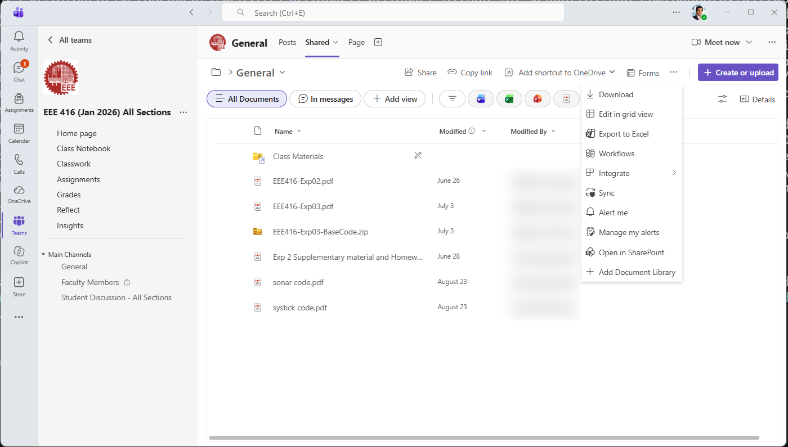
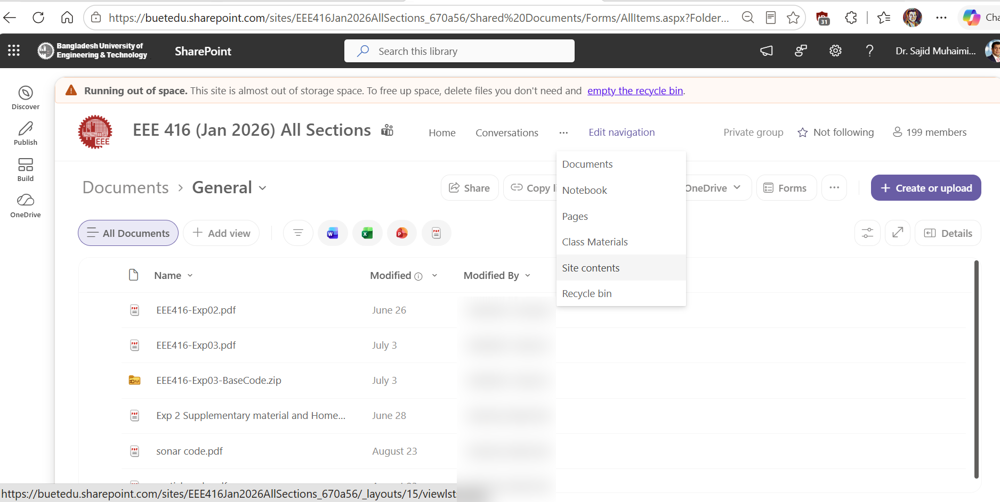
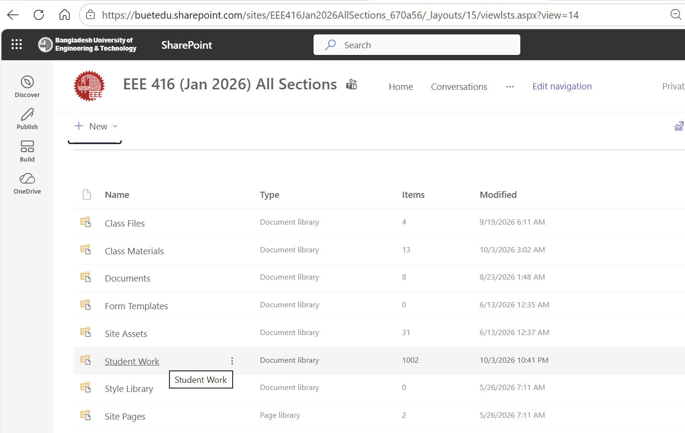
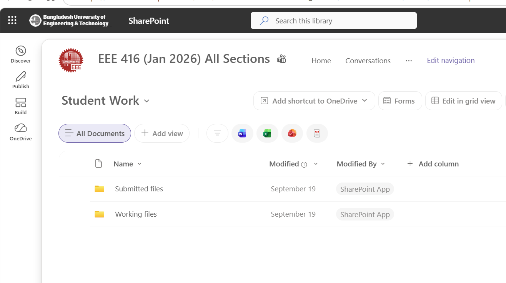
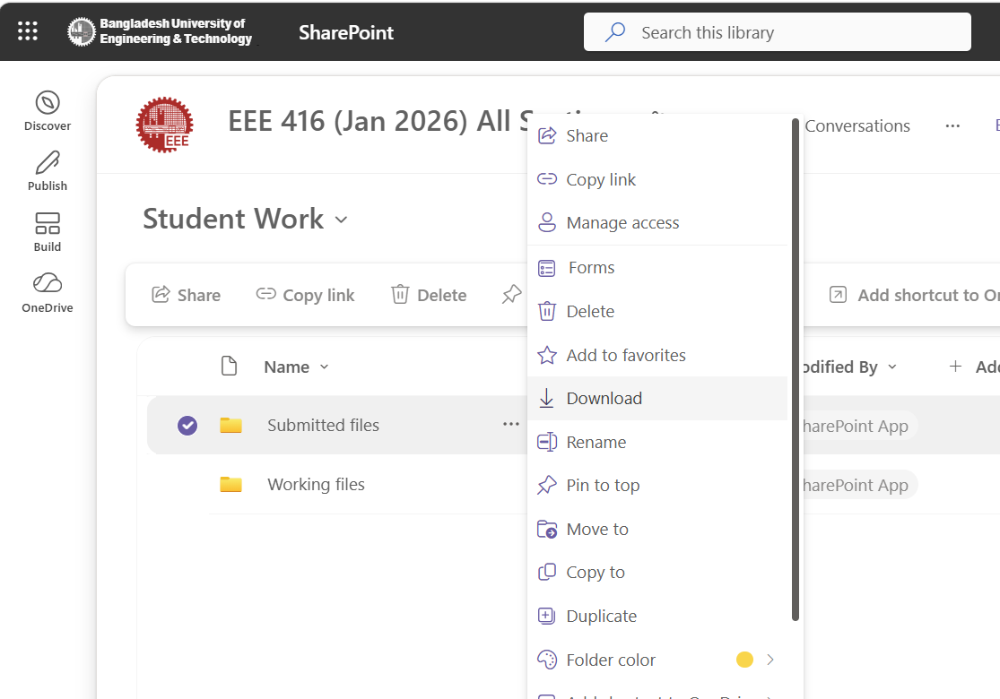
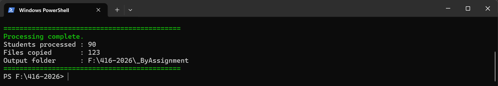

Microsoft Teams makes collecting assignments convenient, but the folder structure obtained when the submissions are downloaded from SharePoint is not always convenient for offline marking or archiving.

A bulk download is organized primarily **by student**. Each student has a folder, each assignment appears as a subfolder, and the submitted file may be stored inside another folder such as `Version 1`.

For example:

```text
416-2026\
├── 2100001 - Student Name\
│   ├── Assignment 1\
│   │   └── Version 1\
│   │       └── report.pdf
│   └── Assignment 2\
│       └── Version 1\
│           └── presentation.pptx
├── 2100002 - Another Student\
│   ├── Assignment 1\
│   │   └── Version 1\
│   │       └── final-report.pdf
│   └── Assignment 2\
│       └── Version 2\
│           └── slides.pptx
└── ...
```

This structure is useful when you want to see everything submitted by one student. However, it is cumbersome when you want to mark or review **one assignment for the entire class**.

A short PowerShell script can reorganize the downloaded files automatically into:

```text
_ByAssignment\
├── Assignment 1\
│   ├── report_2100001_v1.pdf
│   ├── final-report_2100002_v1.pdf
│   └── ...
└── Assignment 2\
    ├── presentation_2100001_v1.pptx
    ├── slides_2100002_v2.pptx
    └── ...
```

The new filename keeps the original filename and adds:

- the **student ID**, taken from the first seven characters of the student's folder name; and
- the **submission version**, such as `v1`, `v2`, etc.

The original downloaded files are left untouched.

---

## 1. Open the class Team in SharePoint

Open the relevant **Class Team** in Microsoft Teams.

Navigate to the Team's files and choose **Open in SharePoint**. Depending on the Teams interface in use, the command may appear as **View in SharePoint**.

This opens the SharePoint site associated with the Team.




> [!NOTE]
> This can also be done from the web browser version of Teams.

---

## 2. Open Site contents

Once the Team site opens in SharePoint, select **Site contents**.

Depending on the SharePoint layout, **Site contents** may be visible in the site navigation or accessible through the Settings menu.



The **Site contents** page lists the document libraries and other resources associated with the Team.

---

## 3. Open Student Work → Submitted Files

From **Site contents**, locate and open the document library named **Student Work**.



Inside **Student Work**, open **Submitted Files**.

The path is:

```text
Site contents
    └── Student Work
        └── Submitted Files
```



Inside `Submitted Files`, the folders are normally organized student by student:

```text
Submitted Files\
├── 2100001 - Student Name\
├── 2100002 - Student Name\
├── 2100003 - Student Name\
└── ...
```

Each student directory contains folders corresponding to that student's assignments.

---

## 4. Download the submissions

Select the **Submitted Files** folder and choose **Download**.




SharePoint will prepare the selected contents for download, normally as a compressed archive.

Save the archive and extract it to a convenient local folder.

For example:

```text
F:\416-2026
```

After extraction, the top level may look like:

```text
F:\416-2026\
├── 2100001 - Student Name\
├── 2100002 - Student Name\
├── 2100003 - Student Name\
└── ...
```

A particular student submission might look like:

```text
2100001 - Student Name\
└── EEE 416 - Project Report and Presentation Sli\
    └── Version 1\
        ├── EEE416-Jan2026-B1-G04-Final-Presentation-v9.pptx
        ├── EEE416_B1-04_Final_Project_presentation.pdf
        ├── EEE416_B1-04_Final_Project_Report (2) (1).docx
        └── EEE416_B1-04_Final_Project_Report.pdf
```

This is the structure that the PowerShell script will reorganize.

---

## 5. Create the PowerShell script

Open **Notepad**, **Visual Studio Code**, or another plain-text editor.

Create a file named:

```text
Organize-Teams-Assignments.ps1
```

For example, save it in the downloaded course folder:

```text
F:\416-2026\Organize-Teams-Assignments.ps1
```

Paste the following script into the file:

```powershell
<#
.SYNOPSIS
    Reorganize downloaded Microsoft Teams / SharePoint
    student submissions by assignment.

.DESCRIPTION
    Expected source structure:

        SourceRoot\
            2100001 - Student Name\
                Assignment A\
                    Version 1\
                        file1.pdf
                        file2.docx
                Assignment B\
                    Version 2\
                        file3.pptx

    Produces:

        SourceRoot\_ByAssignment\
            Assignment A\
                file1_2100001_v1.pdf
                file2_2100001_v1.docx
            Assignment B\
                file3_2100001_v2.pptx

    The student ID is taken from the first seven characters
    of the student folder name.

    The original files are copied, not moved.
#>

param(
    [string]$SourceRoot = "F:\416-2026",
    [string]$OutputRoot = "F:\416-2026\_ByAssignment"
)

$ErrorActionPreference = "Stop"


# ------------------------------------------------------------
# Generate a unique destination filename if necessary
# ------------------------------------------------------------
function Get-UniqueDestinationPath {
    param(
        [Parameter(Mandatory)]
        [string]$Path
    )

    if (-not (Test-Path -LiteralPath $Path)) {
        return $Path
    }

    $directory = [System.IO.Path]::GetDirectoryName($Path)
    $baseName  = [System.IO.Path]::GetFileNameWithoutExtension($Path)
    $extension = [System.IO.Path]::GetExtension($Path)

    $counter = 2

    do {
        $candidate = Join-Path $directory (
            "{0}_{1}{2}" -f $baseName, $counter, $extension
        )

        $counter++
    }
    while (Test-Path -LiteralPath $candidate)

    return $candidate
}


# ------------------------------------------------------------
# Check source directory
# ------------------------------------------------------------
if (-not (Test-Path -LiteralPath $SourceRoot -PathType Container)) {
    throw "Source folder does not exist: $SourceRoot"
}


# ------------------------------------------------------------
# Create output directory
# ------------------------------------------------------------
New-Item `
    -ItemType Directory `
    -Path $OutputRoot `
    -Force |
    Out-Null


Write-Host ""
Write-Host "Source : $SourceRoot"
Write-Host "Output : $OutputRoot"
Write-Host ""

$CopiedCount  = 0
$StudentCount = 0


# ------------------------------------------------------------
# Student directories are expected to begin with a
# seven-digit student ID.
#
# Example:
#
#   2100001 - Student Name
# ------------------------------------------------------------
$StudentFolders = Get-ChildItem `
    -LiteralPath $SourceRoot `
    -Directory |
    Where-Object {
        $_.FullName -ne $OutputRoot -and
        $_.Name -match '^\d{7}'
    }


foreach ($StudentFolder in $StudentFolders) {

    $StudentCount++

    $StudentID = $StudentFolder.Name.Substring(0, 7)

    Write-Host "Student: $StudentID  [$($StudentFolder.Name)]" `
        -ForegroundColor Cyan


    # --------------------------------------------------------
    # Immediate subdirectories are treated as assignments
    # --------------------------------------------------------
    $AssignmentFolders = Get-ChildItem `
        -LiteralPath $StudentFolder.FullName `
        -Directory


    foreach ($AssignmentFolder in $AssignmentFolders) {

        $AssignmentName = $AssignmentFolder.Name

        $DestinationAssignmentFolder = Join-Path `
            $OutputRoot `
            $AssignmentName

        New-Item `
            -ItemType Directory `
            -Path $DestinationAssignmentFolder `
            -Force |
            Out-Null


        # Find all submitted files within the assignment
        $Files = Get-ChildItem `
            -LiteralPath $AssignmentFolder.FullName `
            -File `
            -Recurse


        foreach ($File in $Files) {

            # Default to version 1
            $Version = 1

            $CurrentDirectory = $File.Directory

            # Walk upwards looking for "Version N"
            while (
                $null -ne $CurrentDirectory -and
                $CurrentDirectory.FullName.StartsWith(
                    $AssignmentFolder.FullName,
                    [System.StringComparison]::OrdinalIgnoreCase
                )
            ) {

                if ($CurrentDirectory.Name -match '(?i)^Version\s*(\d+)$') {
                    $Version = [int]$Matches[1]
                    break
                }

                if ($CurrentDirectory.Name -match '(?i)^Version$') {
                    $Version = 1
                    break
                }

                if ($CurrentDirectory.FullName -eq $AssignmentFolder.FullName) {
                    break
                }

                $CurrentDirectory = $CurrentDirectory.Parent
            }


            $OriginalBaseName =
                [System.IO.Path]::GetFileNameWithoutExtension($File.Name)

            $Extension = $File.Extension


            # New filename:
            #
            # OriginalName_StudentID_vN.ext
            #
            $NewFileName = "{0}_{1}_v{2}{3}" -f `
                $OriginalBaseName,
                $StudentID,
                $Version,
                $Extension


            $DestinationPath = Join-Path `
                $DestinationAssignmentFolder `
                $NewFileName


            # Prevent accidental overwriting
            $DestinationPath = Get-UniqueDestinationPath `
                -Path $DestinationPath


            Copy-Item `
                -LiteralPath $File.FullName `
                -Destination $DestinationPath


            $CopiedCount++


            Write-Host (
                "  {0} -> {1}" -f
                $File.Name,
                [System.IO.Path]::GetFileName($DestinationPath)
            )
        }
    }
}


Write-Host ""
Write-Host "============================================" `
    -ForegroundColor Green

Write-Host "Processing complete." `
    -ForegroundColor Green

Write-Host "Students processed : $StudentCount"
Write-Host "Files copied       : $CopiedCount"
Write-Host "Output folder      : $OutputRoot"

Write-Host "============================================" `
    -ForegroundColor Green
```

---

## 6. Set the source and output folders

Near the beginning of the script are these lines:

```powershell
[string]$SourceRoot = "F:\416-2026",
[string]$OutputRoot = "F:\416-2026\_ByAssignment"
```

Change `F:\416-2026` to the directory where you extracted your own Teams submissions.

For example:

```powershell
[string]$SourceRoot = "D:\Courses\EEE416\Submissions",
[string]$OutputRoot = "D:\Courses\EEE416\Submissions\_ByAssignment"
```

The `_ByAssignment` folder does not need to exist beforehand. The script creates it automatically.

---

## 7. Open PowerShell in the folder

Open the downloaded submissions folder in File Explorer.

One convenient method is:

1. Click the File Explorer address bar.
2. Type `powershell`.
3. Press **Enter**.

PowerShell will open with that folder as its current directory.

Alternatively, open PowerShell normally and change directories:

```powershell
cd F:\416-2026
```

Confirm that the script is present:

```powershell
dir
```

You should see:

```text
Organize-Teams-Assignments.ps1
```

---

## 8. Run the script

Run:

```powershell
.\Organize-Teams-Assignments.ps1
```

The script processes each student folder and displays its progress.

For example:

```text
Student: 2100001  [2100001 - Student Name]

  EEE416-Jan2026-B1-G04-Final-Presentation-v9.pptx
    -> EEE416-Jan2026-B1-G04-Final-Presentation-v9_2100001_v1.pptx

  EEE416_B1-04_Final_Project_Report.pdf
    -> EEE416_B1-04_Final_Project_Report_2100001_v1.pdf
```

At the end, it displays a summary:

```text
============================================
Processing complete.
Students processed : 52
Files copied       : 187
Output folder      : F:\416-2026\_ByAssignment
============================================
```


---

## If PowerShell blocks the script

Some Windows systems may prevent `.ps1` files from running because of the PowerShell execution policy.

To allow the script **only for the current PowerShell session**, run:

```powershell
Set-ExecutionPolicy -Scope Process Bypass
```

Then run the script again:

```powershell
.\Organize-Teams-Assignments.ps1
```

Closing that PowerShell window removes the temporary setting.

> [!WARNING]
> On computers managed by an organization, PowerShell execution policy may be centrally controlled. Follow your organization's IT policy rather than changing a machine-wide execution policy.

---

## The resulting folder structure

For this original submission:

```text
2100001 - Student Name\
└── EEE 416 - Project Report and Presentation Sli\
    └── Version 1\
        ├── EEE416-Jan2026-B1-G04-Final-Presentation-v9.pptx
        ├── EEE416_B1-04_Final_Project_presentation.pdf
        ├── EEE416_B1-04_Final_Project_Report (2) (1).docx
        └── EEE416_B1-04_Final_Project_Report.pdf
```

the script creates:

```text
_ByAssignment\
└── EEE 416 - Project Report and Presentation Sli\
    ├── EEE416-Jan2026-B1-G04-Final-Presentation-v9_2100001_v1.pptx
    ├── EEE416_B1-04_Final_Project_presentation_2100001_v1.pdf
    ├── EEE416_B1-04_Final_Project_Report (2) (1)_2100001_v1.docx
    └── EEE416_B1-04_Final_Project_Report_2100001_v1.pdf
```

A later submission version is labelled accordingly. For example:

```text
2100002 - Student Name\
└── Project Report\
    └── Version 3\
        └── Final Report.pdf
```

becomes:

```text
_ByAssignment\
└── Project Report\
    └── Final Report_2100002_v3.pdf
```

---

## What the script does

### Identifies the student

Only folders beginning with seven digits are treated as student folders:

```text
2100001 - Student Name
```

The first seven characters become the student ID:

```text
2100001
```

### Creates one folder per assignment

The existing assignment folder names are reused automatically. There is no need to enter the assignment names separately.

### Detects submission versions

Folders such as:

```text
Version 1
Version 2
Version 3
```

are converted to filename suffixes:

```text
_v1
_v2
_v3
```

If a file is not contained in a numbered Version folder, the script assumes version 1.

### Keeps the original filename

The existing filename is retained. The student ID and submission version are inserted before the extension.

For example:

```text
Project Report.pdf
```

becomes:

```text
Project Report_2100001_v1.pdf
```

### Keeps the original download unchanged

The script uses `Copy-Item`, not `Move-Item`.

The original SharePoint download therefore remains intact and can be retained as the untouched archive.

### Prevents silent overwrites

If two files would produce exactly the same destination filename, the script does not silently replace the first file. It creates a unique filename by adding `_2`, `_3`, and so on.

---

## Why reorganize submissions this way?

The original Teams/SharePoint directory structure effectively answers:

> What did this particular student submit?

For marking and course administration, the more useful question is often:

> What did everyone submit for this particular assignment?

An assignment-wise directory is convenient for:

- grading reports;
- reviewing presentations;
- distributing submissions among multiple evaluators;
- checking whether everyone submitted the required file type;
- batch-opening PDF or Word files;
- running automated processing over submissions;
- comparing different submission versions;
- archiving a completed course; and
- keeping the student ID attached to a file even when it is copied elsewhere.

---

## Before deleting anything from SharePoint

Treat this workflow as an **export and reorganization process**, not as an immediate replacement for the original Teams/SharePoint records.

A sensible sequence is:

1. Download the submissions.
2. Keep the original extracted download.
3. Run the PowerShell script.
4. Check the number of students and copied files.
5. Spot-check several assignments and submission versions.
6. Make any archival or SharePoint cleanup decisions only after verifying the backup.

For important course records, keeping an untouched copy of the original download is a useful precaution.

---

## Complete workflow

```text
Microsoft Teams
      ↓
Open/View in SharePoint
      ↓
Site contents
      ↓
Student Work
      ↓
Submitted Files
      ↓
Download
      ↓
Extract archive
      ↓
Run PowerShell script
      ↓
_ByAssignment
      ↓
One folder per assignment
with Student ID + submission version
in each filename
```

The result is a simple assignment-oriented archive that is much easier to review, mark, distribute, and preserve than the student-oriented structure produced by the raw SharePoint download.

---

## References
- [Microsoft Teams documentation](https://learn.microsoft.com/microsoftteams/)
- [Microsoft SharePoint documentation](https://learn.microsoft.com/sharepoint/)
