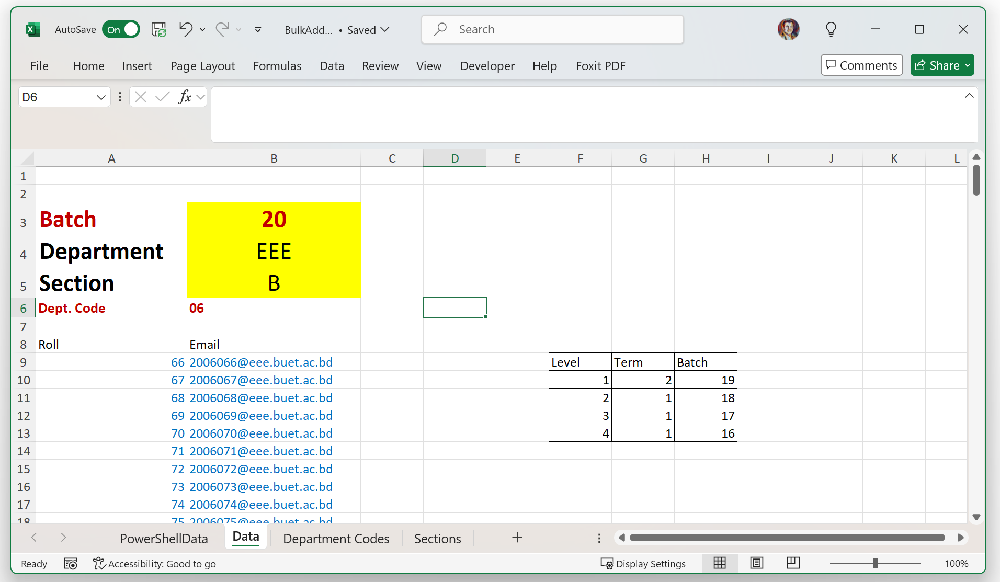
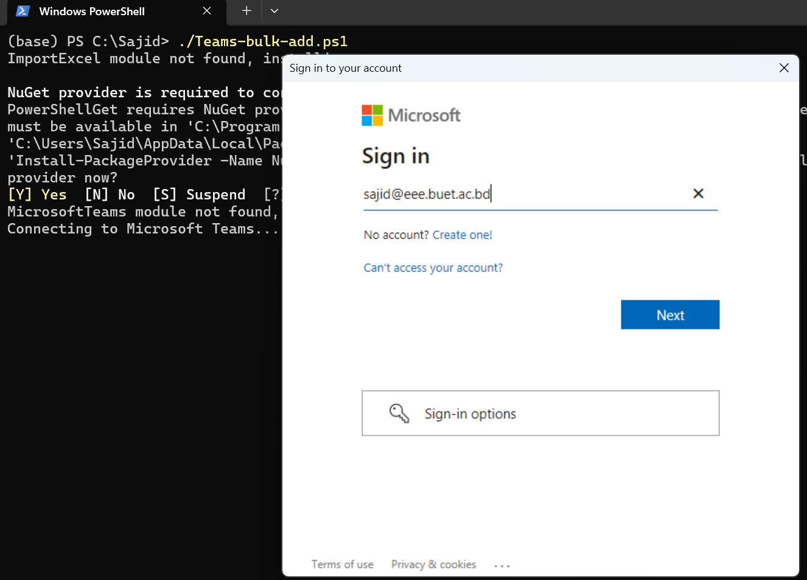
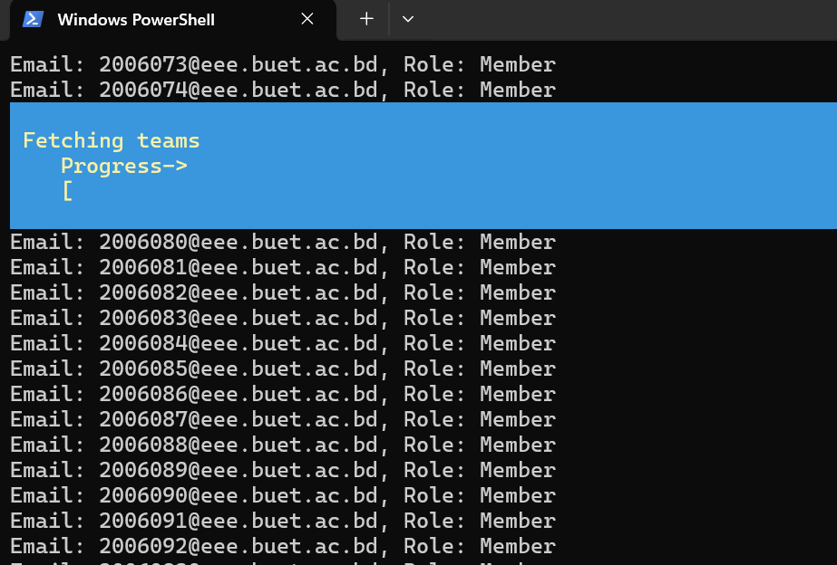

Adding multiple users to a Microsoft Teams group manually can be tedious and error-prone, especially for large groups. As we use Teams to manage class, we need to add upto 35 students for each sessional class, 65 students for theory and 195 students if we want to add the entire batch in a team. Fortunately, we can automate this task using PowerShell simplifies the task, reducing time and mistakes. Also, it is not straight forward to export the list of members from a team to a Excel file.

I am releasing these two templates to make our lives easier:
* [PowerShellScript for Bulk Adding Team Members](BulkAdd.zip)
* [Excel Template for Bulk Adding Team Members](BulkAdd.xlsx)
* [PowerShellScript for Exporting Team Members to Excel](BulkAdd.zip)


In this tutorial, you'll learn how to use PowerShell and Excel to bulk-add users to a Microsoft Teams group. You can also download the templates and directly use them:


## Prerequisites

- [PowerShell](https://learn.microsoft.com/powershell/) installed on your system.
- Owner access to the Microsoft Teams where you will add members. (You need to create the teams using the Microsoft Teams desktop app or web interface)
- Excel file (`BulkAdd.xlsx`) containing users' email addresses and roles.

## Step 1: Installing and Running PowerShell

### Windows Users

Windows typically comes with PowerShell pre-installed. To open it:

1. Click **Start** and type **PowerShell**.
2. Right-click **Windows PowerShell** and choose **Run as administrator**.

If you need to install the latest PowerShell version, download it [here](https://github.com/PowerShell/PowerShell/releases).

### macOS/Linux Users

Download and install PowerShell from the official GitHub repository:

- [Download PowerShell](https://github.com/PowerShell/PowerShell/releases)

After installing, open the terminal and type `pwsh` to launch PowerShell.

## Step 2: Install Necessary Modules

You need two modules: `MicrosoftTeams` and `ImportExcel`.

Open PowerShell as Administrator and run:

```powershell
Install-Module MicrosoftTeams -Scope CurrentUser
Install-Module ImportExcel -Scope CurrentUser
```

## Step 3: Prepare Excel Data

**Download [Excel Template for Bulk Adding Team Members](BulkAdd.xlsx)** 
In the `Data` sheet, enter Batch, Department and Section. The roll number range should be automatically generated for departments with 195 students, and for other departments, you need to tweak the `Sections` sheet.


## Step 4: PowerShell Script

Here's the script that automates the bulk addition of users:

**[Download PowerShellScript for Bulk Adding Team Members](BulkAdd.zip)**
Unzip the file and extract the `Teams-bulk-add.ps1` file, keep it in same folder as the excel file.

Modify the `TeamDisplayName` variable as your team's name:


```powershell {linenos=inline hl_lines=[2] style=emacs}
# Define Team display name
$TeamDisplayName = "EEE 416 (Jan 2025) B1 + B2"

# Ensure ImportExcel module is installed
if (!(Get-Module -ListAvailable -Name ImportExcel)) {
    Write-Host "ImportExcel module not found, installing..."
    Install-Module ImportExcel -Scope CurrentUser -Force
} else {
    Write-Host "ImportExcel module already installed."
}

# Ensure MicrosoftTeams module is installed
if (!(Get-Module -ListAvailable -Name MicrosoftTeams)) {
    Write-Host "MicrosoftTeams module not found, installing..."
    Install-Module MicrosoftTeams -Scope CurrentUser -Force
} else {
    Write-Host "MicrosoftTeams module already installed."
}

# Import required modules
Import-Module ImportExcel
Import-Module MicrosoftTeams

# Connect to Microsoft Teams
Write-Host "Connecting to Microsoft Teams..."
Connect-MicrosoftTeams

# Get Team Group ID
$team = Get-Team -DisplayName $TeamDisplayName

if ($null -eq $team) {
    Write-Host "No team found with display name '$TeamDisplayName'. Exiting script."
    exit
}

$groupId = $team.GroupId
Write-Host "Team '$TeamDisplayName' found. Group ID: $groupId"

# Read data from BulkAdd.xlsx (assuming file is in the same folder as script)
$scriptPath = Split-Path -Path $MyInvocation.MyCommand.Definition -Parent
$excelPath = Join-Path $scriptPath "BulkAdd.xlsx"

if (!(Test-Path $excelPath)) {
    Write-Host "File 'BulkAdd.xlsx' not found in script directory. Exiting script."
    exit
}

# Read the Excel sheet named "PowerShellData"
$data = Import-Excel -Path $excelPath -WorksheetName "PowerShellData"
Write-Host "Debugging imported data:"
$data | Format-Table

foreach ($row in $data) {
    $email = $row | Select-Object -ExpandProperty (Get-Member -InputObject $row -MemberType NoteProperty | Select-Object -First 1 -ExpandProperty Name)
    $role = $row | Select-Object -ExpandProperty (Get-Member -InputObject $row -MemberType NoteProperty | Select-Object -Skip 1 -First 1 -ExpandProperty Name)

    if ([string]::IsNullOrEmpty($email) -or [string]::IsNullOrEmpty($role)) {
        Write-Host "Empty email or role found. Skipping..."
        break
    }

    Write-Host "Email: $email, Role: $role"

    #Add users to team (uncomment the following line to add users to the team)
    Add-TeamUser -GroupId $groupId -User $email -Role $role
}

Write-Host "Process completed."
```

Replace `Your Team Display Name` with your actual Microsoft Teams name where you want to add the members.


## Step 5: Execute the Script

Save this script as `Teams-bulk-add.ps1`. Run it by opening PowerShell and executing:

```powershell
Set-ExecutionPolicy RemoteSigned -Scope CurrentUser
.\Teams-bulk-add.ps1
```

* If prompted about execution policy, type `Y` and hit Enter.

* Log into Microsoft Teams after Running the script


* Here is a screenshot of the script adding members to the team


* Here is a screenshot of the teams after all 65 members added.


## Step 6: Fetch Team Member list
**Download [PowerShellScript for Exporting Team Members to Excel](BulkAdd.zip)**

Modify the `TeamDisplayName` variable as your team's name.

```powershell{linenos=inline hl_lines=[2] style=emacs}
# Define Team display name
$TeamDisplayName = "EEE 416 (Jan 2025) B1 + B2"

# Connect to Microsoft Teams
Write-Host "Connecting to Microsoft Teams..."
Connect-MicrosoftTeams

# Get Team Group ID
$selectedTeam = Get-Team -DisplayName $TeamDisplayName

if ($null -eq $selectedTeam) {
    Write-Host "No team found with display name '$TeamDisplayName'. Exiting script."
    exit
}


if (-not $selectedTeam) {
    Write-Error "Team '$teamName' not found. Exiting script."
    exit
}

# Get the members of the selected Team
$members = Get-TeamUser -GroupId $selectedTeam.GroupId

# Sort members by Email Address
$sortedMembers = $members | Sort-Object User

# Prepare data
$memberDetails = foreach ($member in $sortedMembers) {
    [PSCustomObject]@{
        "Display Name"  = $member.Name
        "Email Address" = $member.User
        "Role"          = $member.Role
    }
}

# Install ImportExcel Module if not already installed
if (-not (Get-Module -ListAvailable -Name ImportExcel)) {
    Install-Module -Name ImportExcel -Scope CurrentUser -Force
}

# Import the ImportExcel module
Import-Module ImportExcel

# Define Excel file name
$excelFileName = ($selectedTeam.DisplayName -replace ' ','_') + "_TeamMembers.xlsx"

# Export to Excel
$memberDetails | Export-Excel -Path $excelFileName -AutoSize -WorksheetName "Team Members"

Write-Host "Team members exported successfully to $excelFileName" -ForegroundColor Green
```
Run the script
```powershell
Set-ExecutionPolicy RemoteSigned -Scope CurrentUser
.\Teams-getmembers.ps1
```
The script would create an excel file with all team members. 

## Conclusion

You've now automated the bulk addition of users into Microsoft Teams using PowerShell. This approach saves considerable time, especially when managing large teams.

Happy automating!

Note: I might update the script in the future, where it would check against the BIIS generated roll number list, and also automatically remove members that are not present in the BIIS list, but that might need further testing.
