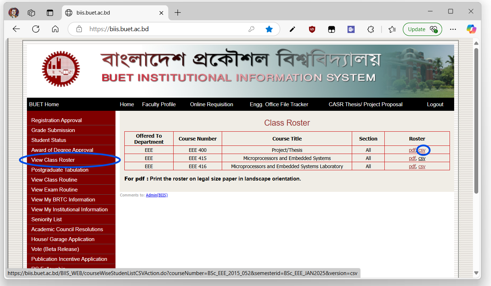
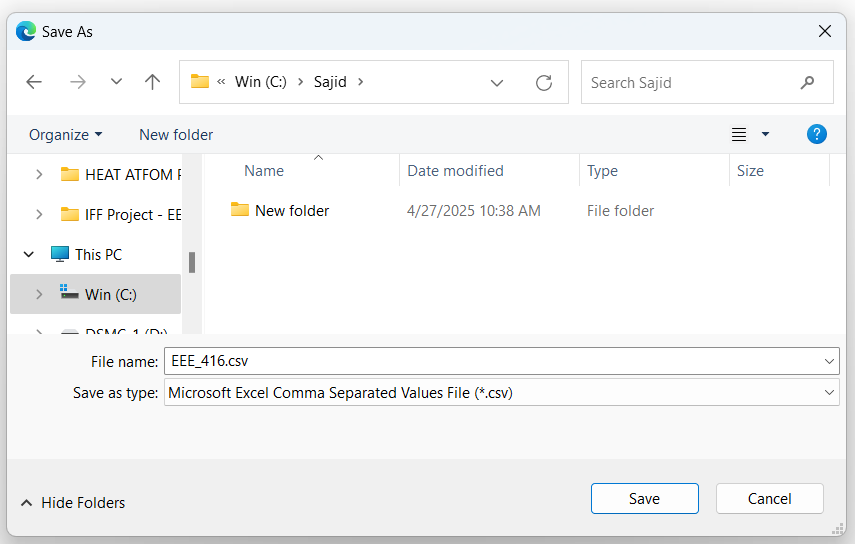
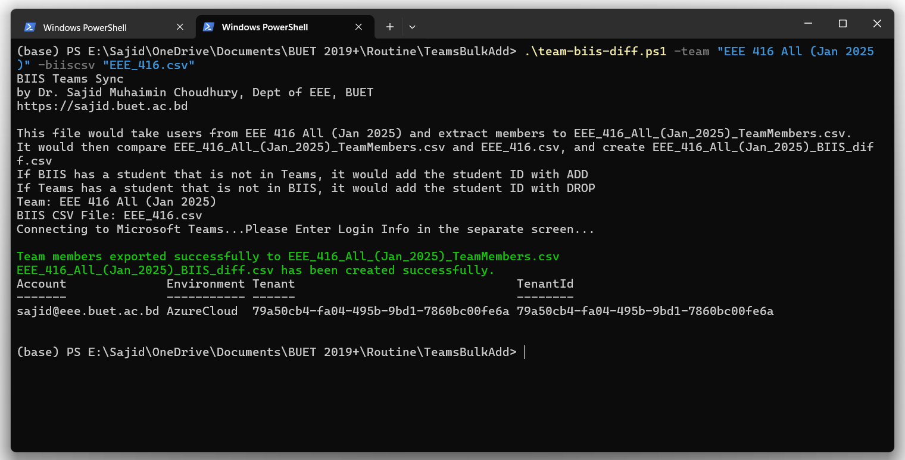
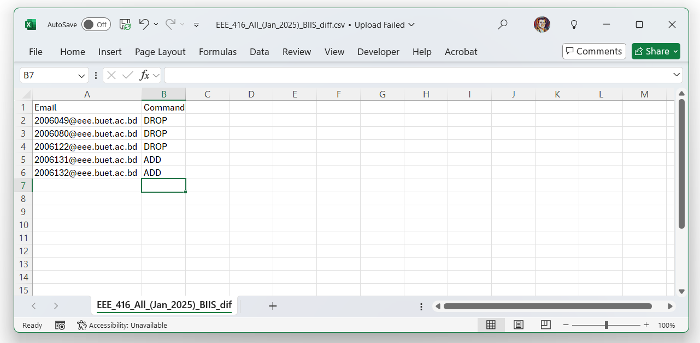

BUET uses a BIIS system, that tracks registered students on a course. Course teachers can download their attendance sheet in `.csv` format. Teachers also use Teams for sharing class materials and assignments. Unfortunately, registration deadline is almost 2 weeks into the classes, and letting unregistered students do class causes later administrative problems. So, teachers often add all students in team of the section. It is a tedious process to check if a member teams is also registered in BIIS. In an ideal world, BIIS should have integrated Canva / Moodle for each class. However, at present, we can use this method to quickly cross check Teams and BIIS members. Please check my [previous tutorial on PowerShell](/outreach/blog/20250427-Microsoft-Teams-BIIS-Check) to see how it is installed and used. 

This tutorial is only applicable for BUET teachers.

## Step 1: Download BIIS Attendance Sheet
Log in to your faculty BIIS account, go to View Class Roster, Select Level Term and from the course list, download the csv file of the course.



## Step 2: Prepare Script
In the same folder of the `csv` file, either download and copy of [this script file (team-biis-diff.zip)](team-biis-diff.zip) and unzip

OR

Create a blank text file in the same folder of the  `csv` file, rename it to `team-biis-diff.ps1`. Copy the following code in that file using note pad.

````powershell
#usage 
#.\team-biis-diff.ps1 -team "EEE 416 All (Jan 2025)" -biiscsv "EEE_416.csv"
param(
    [string]$team = "EEE 416 All (Jan 2025)",
    [string]$biiscsv = "EEE_416.csv"
)
# Define CSV file name
$teamcsvFileName = ($team -replace ' ','_') + "_TeamMembers.csv"
$teamcsvDiffFileName = ($team -replace ' ','_') + "_BIIS_diff.csv"
Write-Host "BIIS Teams Sync"
Write-Host "by Dr. Sajid Muhaimin Choudhury, Dept of EEE, BUET"
Write-Host "https://sajid.buet.ac.bd"
Write-Host ""
Write-Host "This file would take users from $team and extract members to $teamcsvFileName."
Write-Host "It would then compare $teamcsvFileName and $biiscsv, and create $teamcsvDiffFileName"
Write-Host "If BIIS has a student that is not in Teams, it would add the student ID with ADD"
Write-Host "If Teams has a student that is not in BIIS, it would add the student ID with DROP"
# Rest of your script logic here (replace with your actual code)
Write-Host "Team: $team"
Write-Host "BIIS CSV File: $biiscsv"
# Show help if no parameters are provided
if ($PSBoundParameters.Count -eq 0) {
    $scriptName = $MyInvocation.MyCommand.Name
    Write-Host ""
    Write-Host "ERROR: No Parameters given. Pass parameters." -ForegroundColor Red
    Write-Host "Usage: .\$scriptName [-team <TeamName>] [-biiscsv <CSVFileName>]"  -ForegroundColor Red
    Write-Host "Example: .\$scriptName -team 'EEE 101 Jan 2023' -biiscsv 'EEE_101.csv'"
    Write-Host ""
}
# Connect to Microsoft Teams
Write-Host "Connecting to Microsoft Teams...Please Enter Login Info in the separate screen..."
Connect-MicrosoftTeams
# Get Team Group ID
$selectedTeam = Get-Team -DisplayName $team
if ($null -eq $selectedTeam) {
    Write-Host "ERROR: No team found with display name '$team'. Exiting script." -ForegroundColor Red
    exit
}
# Get the members of the selected Team
$members = Get-TeamUser -GroupId $selectedTeam.GroupId
# Sort members by Email Address
$sortedMembers = $members | Sort-Object User
# Prepare data
$memberDetails = foreach ($member in $sortedMembers) {
    [PSCustomObject]@{
        "Display Name"  = $member.Name
        "Email Address" = $member.User
        "Role"                   = $member.Role
    }
}
# Export to CSV
$memberDetails | Export-Csv -Path $teamcsvFileName -NoTypeInformation -Encoding UTF8
Write-Host "Team members exported successfully to $teamcsvFileName" -ForegroundColor Green
# 2 Import BIIS data without headers
$BIISData = Import-Csv -Path $biiscsv -Header "StudentID", "Name", "PersonalEmail", "OfficialEmail", "PhoneNumber"
# Extract official emails from BIIS data
$BIIS_OfficialEmails = $BIISData | Where-Object { $_.OfficialEmail -and $_.OfficialEmail.Trim() -ne "" } | Select-Object -ExpandProperty OfficialEmail
# Import Teams data
$TeamsData = Import-Csv -Path $teamcsvFileName
# Filter Teams data to include only members
$Teams_Members = $TeamsData | Where-Object { $_.Role -eq "member" }
# Extract email addresses from Teams members
$Teams_Emails = $Teams_Members | Where-Object { $_."Email Address" -and $_."Email Address".Trim() -ne "" } | Select-Object -ExpandProperty "Email Address"
# Determine emails to add (in BIIS but not in Teams)
$EmailsToAdd = $BIIS_OfficialEmails | Where-Object { $_ -notin $Teams_Emails }
# Determine emails to drop (in Teams but not in BIIS)
$EmailsToDrop = $Teams_Emails | Where-Object { $_ -notin $BIIS_OfficialEmails }
# Prepare the output data
$OutputData = @()
foreach ($email in $EmailsToAdd) {
    $OutputData += [PSCustomObject]@{
        Email   = $email
        Command = "ADD"
    }
}
foreach ($email in $EmailsToDrop) {
    $OutputData += [PSCustomObject]@{
        Email   = $email
        Command = "DROP"
    }
}
# Export the results to a CSV fil
$OutputData | Export-Csv -Path $teamcsvDiffFileName -NoTypeInformation -Encoding UTF8
Write-Host "$teamcsvDiffFileName has been created successfully." -ForegroundColor Green
````
Save the `ps1` file.

## Step 3: Run PowerShell Script
1. Click **Start** and type **PowerShell**.
2. Right-click **Windows PowerShell** and choose **Run as administrator**.
3. In powershell window, go to the folder where you have the script and the `.csv` file, and run the script with this command:
````powershell
.\team-biis-diff.ps1 -team "YOURTEAMNAME" -biiscsv "EEE_416.csv"
````
Replace `YOURTEAMNAME` with the actual display name of your team, and ``EEE_416.csv`` with the name of your csv. For convenience, you can also keep this text in the 1st line of your script as a comment, and copy paste it. 
Here is a sample output of a successful run in powershell:

4. You can log into teams with your faculty account. If you have **owner** access to the team, it would create another csv in the folder with all students to be added or dropped from the class. Here is a screenshot of a sample CSV.


## Step 4: Take Action!
1. For students who are marked **DROP** in CSV file, ensure that they are indeed registered for the class (sometimes the registration is pending approval from advisor / head). If they are indeed not in the class, remove them from the teams manually.
2. Students who are marked **ADD** needs to be added in the teams.


