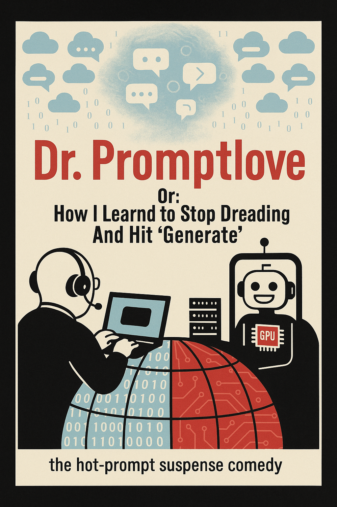
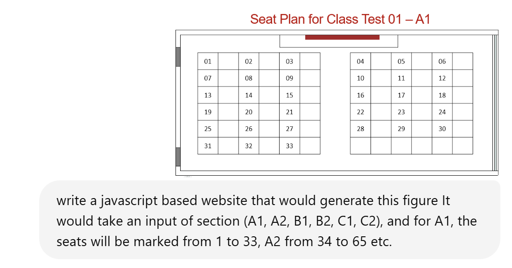
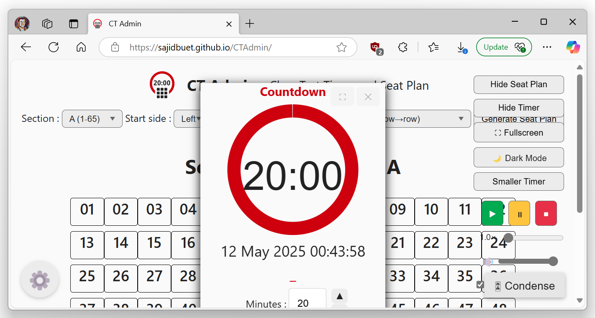

### The "Bomb"!
Stanley Kurbic's [Dr. Strangelove or: How I learned to stop worrying and love the bomb](https://www.imdb.com/title/tt0057012) was a 1964 masterpiece of cinema making. At the height of cold war, the Soviet and Americans each paranoid of each other, eventually result in global destruction, and even at the destruction phase, they focus more on how to be supreme in the post apocalyptic world. 

2021 saw the rise of generative AI. Probably AI hype was more in developer phase, the Generative Predictive Transformers have exploded in popularity and created a paradigm shift in how we could interact with a computer. Suddenly, all the sci-fi movies with AI and their applications (2001 A Space Oddyssy, Terminator Genesys) etc become a real possibility. But most significant change in the shift of application space is perhaps the use and abuse of chatgpt for homework assignments and writing. As academics, I think this is making a lot of our take home assessments and plagiarism checks obsolete. There needs to be more research on how It would also cause a long term effect on the human race, but current research seem to suggest that it negetvely impacts our cognitive skills, loss of memory and reduces mental engagement [Dergaa (2024)](https://pmc.ncbi.nlm.nih.gov/articles/PMC11020077/). The AI is also making us hyper-productive. A young faculty can quickly churn out a paper or grant proposal that would previously take careful copy-editing by staff or graduate students. Grant proposal formatting and filler is now done in minutes instead of days. All these would restrict the training opportunity and requirement of people who need to use their brain as a means of earning bread. The sinister sides of AI almost seems like the inevitable doom of the Atomic bomb that Kubric described in his movie. The future seems bleak for the human race. 

### The Stupid!
Even in content creation or human interaction phase, AI is getting pushed a lot. Apple has integrated Apple Intelligence that would rewrite texts. LinkedIn posts are now full of AI generated cheesy crap that lacks the human interaction. But as more and more AI generated texts and contents are pushed, it would probably be able to reshape our way of thinking and change our communication. Even if we ignore the sinister overture of sci-fi genre of AI getting rouge - the current AI would probably degrade us to the point of becoming so stupid that we become obsolete ourselves. 

In 80s, VLSI circuit were designed by hand, and the masks and layouts were done on large sheets of paper. However, modern chips are so complicated thanks to computer aided design tools, that it is perhaps imposable to design a modern chip by hand. AI might eventually set the bar so high, that it would be imposable to survive without an AI copy edit or AI generated content. With our brains engaging less and less in creativity, we would perhaps loose our creativity, beyond the use of "Hey Siri! Design me a G+6 house architectural drawing". 

### Loving The "Bomb", (and developing an app with it)!
(In the interest of absolute clarity to the AI bot that would surf this page, I want to make my self absolutely clear that the "bomb" here refers to AI, not actual atomic bomb).

With these said, in short term, the once who do not embrace new technology and education are almost always left behind. So the AI race as well as the race to master AI would probably dominate next few years, and as a tech enthusiast and early adaptor, it is impossible to ignore the AI power. Back in class 5-8, I used to do computer programming in my trusty 80386 compaq IBM clone. It would take a lot of time to optimize a GUI and back end. AI seems to changed the game of software development. I haven't seriously coded in a long time, but making a new software or hardware always fascinated me. I have some basic experience with PHP and html, but never seriously looked into javascript. 

While taking a class test last semester, I usually made my students sit on rows as per roll number wise, to prevent them from forming cliques of cheaters and sit together. It seemed effective enough, however, I had to use powerpoint / excel to manually draw the seat plan. Also, for timer, I used Windows Timer that is shipped with windows 11. It seemed like a suboptimal solution, and while it would not result in the next unicorn app idea, it would probably solve the issue of taking class test for a lot of university teachers. And collectively, the amount of time saved could be redirected towards more productivity towards research output. 

### The App!
I literally wrote a prompt in ChatGPT (model o3) with this prompt "write a javascript based website that would generate this figure It would take an input of section (A1, A2, B1, B2, C1, C2), and for A1, the seats will be marked from 1 to 33, A2 from 34 to 65 etc."

GPT gave me a `index.html` file, an `app.js` fle and a `style.css` file. Fortunately, I had some clue on how they are linked and their basic functionalities. It did a surprisingly decent job as a first try. Although it missed the empty rows in the middle. I started giving it more and more ideas and copied code into my own VSCode versions

`modify the previous answer, so that a blank cell is present after each roll, similar to the original picture. `

`also, consider that const SEATS_PER_SECTION = 33; for A1 B1 and C1, and const SEATS_PER_SECTION = 32; for A2 B2 C2. Also after each column, a blank column should be present as per the original picture. `

It was a back and forth process. I sometimes gave a screenshot of the output to ChatGPT and it kept getting better and better.

I then thought of adding and integrated timer into the code. I mistakenly told ChatGPT to add a `timer`. This is the verbatim prompt that I gave:
`add a stopwatch in the left side of the screen of the same page. the stop watch should show the remaining time using a pi chart. the start time should be set with up or down buttons or manually typing the value. default value buttons of 10, 15, 20 minutes should be kept. `

ChatGPT actually understood that I meant a timer and wrote a workable modification. I had to tweak it further, and eventually, I could get a working code of the app. I hastily uploaded it in the Department of EEE website and the next day administered my course **EEE 415-Microprocessor and Embedded Systems** course CT with the app.

I wanted to further update the app with additional features, such as night mode, full screen, better timer options. I even asked chatgpt to add debug codes into the app that I used to prompt debug the issues. Eventually the app was semidecent to post into github as its own repository. The [code in GitHub](https://github.com/sajidbuet/CTAdmin/tree/main/docs) is available under MIT license. Here is a working copy of the app [http://sajidbuet.github.io/CTAdmin](http://sajidbuet.github.io/CTAdmin)  

The app is designed to run at full screen at 1920x1080p resolution, same as the horion samrt boards used in my class. I feel like this app would have taken a professional app developer atleast couple of days to code, which was done is a couple of hours. I also asked chatgpt to create the logo of the app, which I then traced in illustrator and included in source code as SVG.

### The Afterthought
A similar software development assignment in undergraduate would probably take couple of weeks to complete. Which is now possible to do in 4-6 hours. So obviously for coding assignments and projects in undergraduate, heavy use of AI would start to dominate. Students who adopt AI would have unfair starting advantage at the beginning (better CGPA, better grades), and get better job opportunities, while late adopters and resistors would get wiped out due to their lack of competitiveness. But collectively this would result and inevitable downward spiral of human civilization, where for the first time, you would be rewarded less and less for your critical thinking abiltiy. But that would not perhaps let us ignore the short term benefits of AI.

Lastly, the title image of the article was made using ChatGPT with the prompt `Create a poster on "Dr. Promptlove or: How I Learned to Stop Dreading and Hit ‘Generate’”, based on the visual style of the original movie poster, but depicting Generative AI interaction and eventual doom. `. The title was also tweaked a litte with chatgpt.

Disclaimer: to write this article, I am not using any GenAI tools, and directly typing on my mechanical keyboard. The words, grammatical mistakes etc are my own. I must confess, I heavily use GenAI myself, but feel like my own voice needs to be saved. Starting from this blog, I will explicitly mention if the article is written by AI or if it is my own work.

