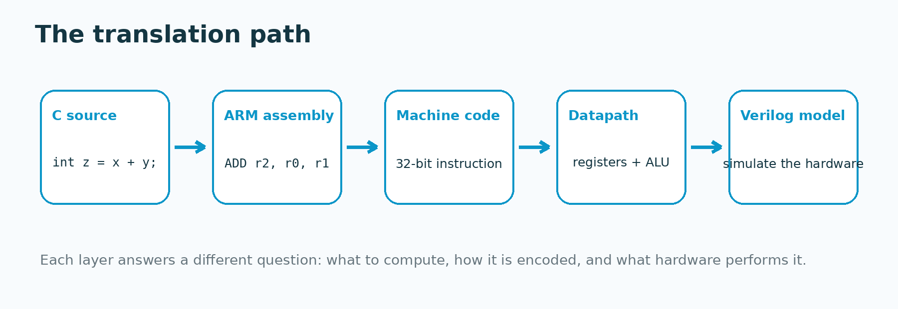
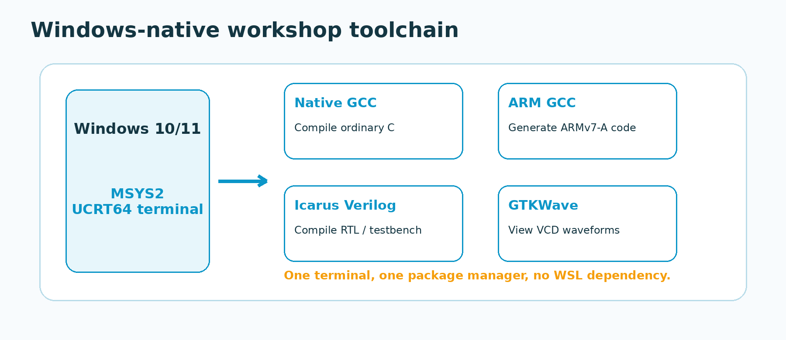
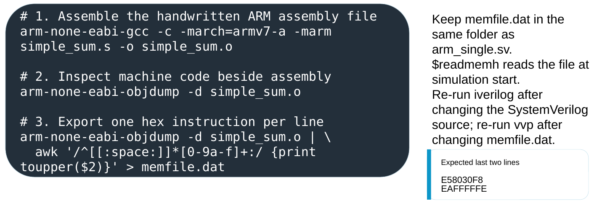
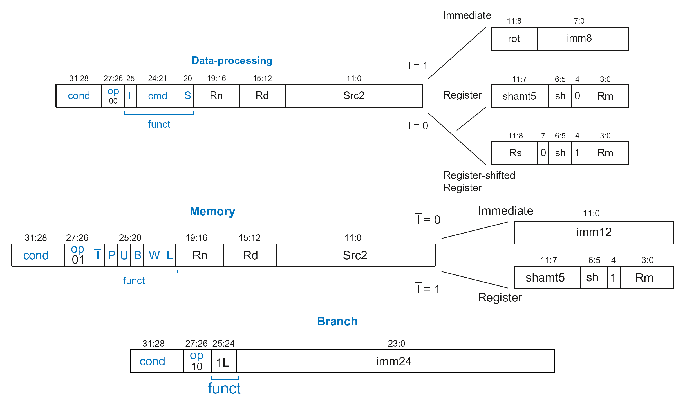
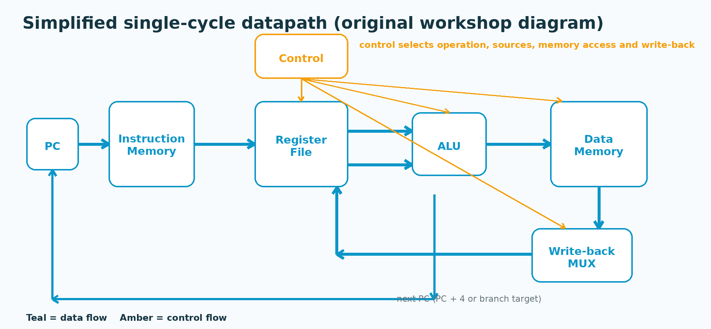
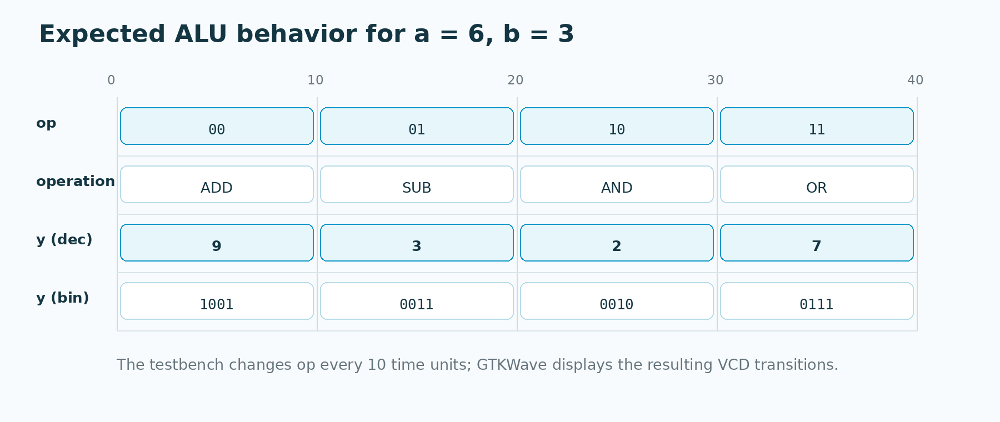
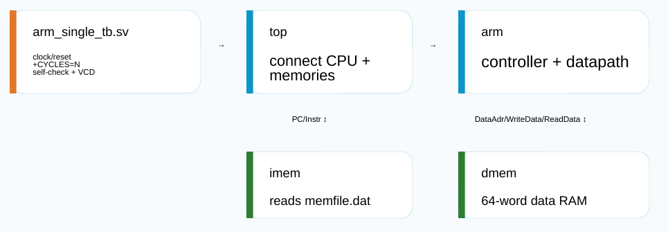

<a id="top"></a>

This handout is designed to be followed from top to bottom during the workshop and reused later as a laboratory reference. The presentation is the primary source for the sequence, terminology, examples, and commands. Where the software-installation details were checked against current online documentation, those items are marked as **web-verified** and linked to official project or vendor pages.



> **Workshop question:** How does a statement such as `z = x + y;` become an electrical operation inside a processor?

## Table of Contents

- [Table of Contents](#table-of-contents)
- [1. Workshop Overview](#1-workshop-overview)
- [2. Learning Objectives and Scope](#2-learning-objectives-and-scope)
- [3. Required Software](#3-required-software)
  - [3.1 Software and official pages](#31-software-and-official-pages)
  - [3.2 Install MSYS2](#32-install-msys2)
  - [3.3 Update the package database and installed packages](#33-update-the-package-database-and-installed-packages)
  - [3.4 Install the workshop packages](#34-install-the-workshop-packages)
  - [3.5 Verify the installation](#35-verify-the-installation)
  - [3.6 Create a workshop folder](#36-create-a-workshop-folder)
- [4. Workshop Files](#4-workshop-files)
  - [4.1 Required processor files](#41-required-processor-files)
  - [4.2 Files students create or generate during the workshop](#42-files-students-create-or-generate-during-the-workshop)
- [5. Toolchain Overview](#5-toolchain-overview)
- [6. What Is an ARM Instruction?](#6-what-is-an-arm-instruction)
- [7. ARM Registers and Load/Store Architecture](#7-arm-registers-and-loadstore-architecture)
  - [7.1 Load → operate → store](#71-load--operate--store)
- [8. Hands-on 1 — Generate ARM Assembly from C](#8-hands-on-1--generate-arm-assembly-from-c)
  - [Objective](#objective)
  - [Procedure](#procedure)
  - [What the options mean](#what-the-options-mean)
- [9. Read the Generated Assembly](#9-read-the-generated-assembly)
  - [Compare with optimization](#compare-with-optimization)
  - [Optional machine-code view](#optional-machine-code-view)
- [10. Machine Code and `memfile.dat`](#10-machine-code-and-memfiledat)
- [11. A Quick Look at A32 Instruction Fields](#11-a-quick-look-at-a32-instruction-fields)
  - [11.1 Condition field](#111-condition-field)
  - [11.2 Main operation class](#112-main-operation-class)
  - [11.3 Example: `ADD R3, R1, R2`](#113-example-add-r3-r1-r2)
  - [11.4 Memory and branch examples](#114-memory-and-branch-examples)
- [12. The Simplified ARM Processor](#12-the-simplified-arm-processor)
- [13. The Single-Cycle Datapath](#13-the-single-cycle-datapath)
- [14. Verilog/SystemVerilog Essentials](#14-verilogsystemverilog-essentials)
- [15. Hands-on 2A — Build the 4-bit ALU](#15-hands-on-2a--build-the-4-bit-alu)
  - [Objective](#objective-1)
  - [Operation table](#operation-table)
  - [Procedure](#procedure-1)
- [16. Hands-on 2B — Test and Inspect the ALU](#16-hands-on-2b--test-and-inspect-the-alu)
  - [Create the testbench](#create-the-testbench)
  - [Compile, simulate, inspect](#compile-simulate-inspect)
- [17. Hands-on 3A — Write the Deterministic ARM Program](#17-hands-on-3a--write-the-deterministic-arm-program)
  - [Procedure](#procedure-2)
  - [What the program does](#what-the-program-does)
- [18. Hands-on 3B — Generate `memfile.dat`](#18-hands-on-3b--generate-memfiledat)
  - [Procedure](#procedure-3)
- [19. Separated Processor and Testbench Architecture](#19-separated-processor-and-testbench-architecture)
- [20. Hands-on 3C — Compile and Run the Processor](#20-hands-on-3c--compile-and-run-the-processor)
  - [Procedure](#procedure-4)
  - [What the compile options mean](#what-the-compile-options-mean)
- [21. Runtime Cycle Control and Recompilation Rules](#21-runtime-cycle-control-and-recompilation-rules)
  - [21.1 What `CYCLES` counts](#211-what-cycles-counts)
  - [21.2 When to recompile](#212-when-to-recompile)
  - [21.3 What if only `memfile.dat` changes?](#213-what-if-only-memfiledat-changes)
- [22. GTKWave Inspection of the ARM Execution](#22-gtkwave-inspection-of-the-arm-execution)
  - [22.1 Navigate the hierarchy](#221-navigate-the-hierarchy)
  - [22.2 Recommended signals](#222-recommended-signals)
  - [22.3 Change buses to hexadecimal](#223-change-buses-to-hexadecimal)
  - [22.4 Zoom and follow the instruction stream](#224-zoom-and-follow-the-instruction-stream)
- [23. Expected Processor Behaviour and Verification Checklist](#23-expected-processor-behaviour-and-verification-checklist)
  - [Verification checklist](#verification-checklist)
- [24. Troubleshooting](#24-troubleshooting)
  - [`arm-none-eabi-gcc: command not found`](#arm-none-eabi-gcc-command-not-found)
  - [`iverilog: command not found` or `vvp: command not found`](#iverilog-command-not-found-or-vvp-command-not-found)
  - [`Unable to open memfile.dat` / `$readmemh` error](#unable-to-open-memfiledat--readmemh-error)
  - [File appears missing even though you saved it in Notepad](#file-appears-missing-even-though-you-saved-it-in-notepad)
  - [Verilog syntax error in the ALU exercise](#verilog-syntax-error-in-the-alu-exercise)
  - [`arm_single.vcd` is not created](#arm_singlevcd-is-not-created)
  - [GTKWave opens but no traces are visible](#gtkwave-opens-but-no-traces-are-visible)
  - [Bus values are hard to read](#bus-values-are-hard-to-read)
  - [Unknown `x` values appear](#unknown-x-values-appear)
  - [The final value is wrong](#the-final-value-is-wrong)
  - [The C-generated assembly differs from the handout](#the-c-generated-assembly-differs-from-the-handout)
  - [Fast recovery sequence](#fast-recovery-sequence)
- [25. Suggested Exercises and Extensions](#25-suggested-exercises-and-extensions)
  - [Exercise A — change the ALU inputs](#exercise-a--change-the-alu-inputs)
  - [Exercise B — demonstrate XOR](#exercise-b--demonstrate-xor)
  - [Exercise C — add a zero flag](#exercise-c--add-a-zero-flag)
  - [Exercise D — change only the processor run length](#exercise-d--change-only-the-processor-run-length)
  - [Exercise E — relate machine code to waveform](#exercise-e--relate-machine-code-to-waveform)
  - [Beyond this workshop](#beyond-this-workshop)
- [26. Summary and References](#26-summary-and-references)
  - [Three takeaways](#three-takeaways)
  - [Workshop and textbook reference](#workshop-and-textbook-reference)
  - [Official technical references](#official-technical-references)

---

<a id="1-workshop-overview"></a>

## 1. Workshop Overview

The workshop connects five views of the same computation:

```text
C source
   ↓
ARM assembly
   ↓
32-bit machine code
   ↓
single-cycle datapath
   ↓
Verilog/SystemVerilog model + simulation waveform
```

The emphasis is not memorizing ARM encoding or HDL syntax. The goal is to see how software-visible instructions map onto registers, an ALU, memories, control logic, and observable digital signals.

The presentation introduces the layers in this order: source code, ARM assembly, machine code, instruction fields, a simplified processor, Verilog/SystemVerilog, testbenches, Icarus Verilog, and GTKWave. This handout keeps that teaching progression but moves the `simple_sum.s → memfile.dat` generation immediately before the full-processor simulation so that the laboratory workflow is executable from start to finish.

**Suggested live-workshop use:** follow the numbered hands-on procedures. Explanatory subsections can be read in more detail after the workshop.

[↑ Back to top](#top)

<a id="2-learning-objectives-and-scope"></a>

## 2. Learning Objectives and Scope

By the end of the workshop, you should be able to:

- explain the path **C → assembly → machine code → datapath → HDL simulation**;
- recognize the roles of basic AArch32 registers such as `r0`, `r1`, `r2`, `sp`, `lr`, and `pc`;
- explain the load–operate–store mental model;
- generate A32 assembly using `arm-none-eabi-gcc`;
- inspect machine-code words with `arm-none-eabi-objdump`;
- describe and simulate a small combinational ALU;
- distinguish a design module from a simulation testbench;
- compile the supplied single-cycle processor and its **separate** testbench using Icarus Verilog;
- change simulation length using `+CYCLES=N` without recompiling;
- inspect the ARM execution in GTKWave and identify the successful final store.

This is deliberately a gentle introduction. The workshop does **not** attempt to cover pipelines, hazards, caches, speculative execution, virtual memory, detailed ABI rules, synthesis, place-and-route, or timing closure. Real Arm processors are much more sophisticated than the educational single-cycle model used here.

[↑ Back to top](#top)

<a id="3-required-software"></a>

## 3. Required Software

**Recommended platform:** Windows 10/11, 64-bit, using the **MSYS2 UCRT64** terminal. The presentation uses this Windows-native setup to avoid switching between Windows and WSL during a short laboratory session. MSYS2 documents UCRT64 as its modern Universal C Runtime environment and made it the default over MINGW64; the current package pages provide all tools used here.

### 3.1 Software and official pages

| Software | Purpose in this workshop | Official page | Recommended installation |
|---|---|---|---|
| MSYS2 | UCRT64 terminal and `pacman` package manager | [MSYS2](https://www.msys2.org/) / [Installer](https://www.msys2.org/docs/installer/) | Current 64-bit installer; open **MSYS2 UCRT64** |
| Native GCC | General C compiler used in the workshop toolchain | [MSYS2 GCC package](https://packages.msys2.org/packages/mingw-w64-ucrt-x86_64-gcc) | UCRT64 package |
| Arm bare-metal GCC | Generates A32 assembly and assembles `simple_sum.s` | [MSYS2 Arm GCC package](https://packages.msys2.org/packages/mingw-w64-ucrt-x86_64-arm-none-eabi-gcc) | UCRT64 package |
| Icarus Verilog | Compiles Verilog/SystemVerilog designs and testbenches | [Icarus Verilog documentation](https://steveicarus.github.io/iverilog/) / [MSYS2 package](https://packages.msys2.org/packages/mingw-w64-ucrt-x86_64-iverilog) | UCRT64 package |
| GTKWave | Opens VCD waveform files | [GTKWave](https://gtkwave.sourceforge.net/) / [MSYS2 package](https://packages.msys2.org/packages/mingw-w64-ucrt-x86_64-gtkwave) | UCRT64 package |

> **Web-verified on 2026-08-11:** the MSYS2 repository listed Arm GCC 16.1.0-1, Icarus Verilog 13.0-2, and GTKWave 3.3.127-1 in UCRT64. Exact package versions can change; use the current MSYS2 packages rather than pinning these versions.

### 3.2 Install MSYS2

1. Download the current 64-bit installer from the [official MSYS2 installer page](https://www.msys2.org/docs/installer/).
2. Install to the default short path such as `C:\msys64`, unless your laboratory has a managed-software policy.
3. From the Windows Start menu, open **MSYS2 UCRT64**. Do not use the plain **MSYS2 MSYS** shell for these package commands.

### 3.3 Update the package database and installed packages

Run in **MSYS2 UCRT64**:

```bash
pacman -Syu
```

If MSYS2 asks you to close the terminal after updating core components, close all MSYS2 windows, reopen **MSYS2 UCRT64**, and run:

```bash
pacman -Syu
```

again.

### 3.4 Install the workshop packages

```bash
pacman -S --needed \
  mingw-w64-ucrt-x86_64-gcc \
  mingw-w64-ucrt-x86_64-arm-none-eabi-gcc \
  mingw-w64-ucrt-x86_64-iverilog \
  mingw-w64-ucrt-x86_64-gtkwave
```

The Arm GCC package also pulls in the corresponding Arm binutils, including `arm-none-eabi-objdump`. The Icarus package contains both `iverilog` and `vvp`.

### 3.5 Verify the installation

```bash
gcc --version
arm-none-eabi-gcc --version
arm-none-eabi-objdump --version
iverilog -V
vvp -V
gtkwave --version
```

**Pass condition:** each command prints version information rather than `command not found`.

### 3.6 Create a workshop folder

```bash
mkdir -p ~/workshop
cd ~/workshop
pwd
```

You may instead use another writable folder. The important rule for the processor simulation is that `arm_single.sv`, `arm_single_tb.sv`, and `memfile.dat` must be in the working folder when you run the simulation.

[↑ Back to top](#top)

<a id="4-workshop-files"></a>

## 4. Workshop Files

Before beginning the processor simulation, download the three required processor files and place them in the **same working folder**.

### 4.1 Required processor files

| File | Purpose | Download | Place it in |
|---|---|---|---|
| `arm_single.sv` | Single-cycle ARM processor plus instruction and data memories | [Download `arm_single.sv`](files/arm_single.sv) | `~/workshop` |
| `arm_single_tb.sv` | Separate simulation testbench containing clock/reset generation, `+CYCLES=N` control, self-checking, and waveform dumping | [Download `arm_single_tb.sv`](files/arm_single_tb.sv) | `~/workshop` |
| `memfile.dat` | ARM machine-code program loaded by the processor's instruction memory | [Download `memfile.dat`](files/memfile.dat) | `~/workshop` |

After downloading, your workshop directory should contain:

```text
workshop/
├── arm_single.sv
├── arm_single_tb.sv
└── memfile.dat
```

### 4.2 Files students create or generate during the workshop

| File | Purpose | Action |
|---|---|---|
| `add.c` | Tiny C function for compiler observation | Create during Hands-on 1; [reference copy](files/reference/add.c) |
| `add_armv7a.s` | Compiler-generated assembly | Generated by GCC |
| `simple_alu.v` | 4-bit combinational ALU | Create during Hands-on 2; [reference copy](files/reference/simple_alu.v) |
| `tb_simple_alu.v` | ALU testbench | Create during Hands-on 2; [reference copy](files/reference/tb_simple_alu.v) |
| `alu_sim` | Compiled Icarus simulation | Generated by `iverilog` |
| `alu.vcd` | ALU waveform | Generated by `vvp` |
| `simple_sum.s` | Deterministic A32 demo program | Create during Hands-on 3; [reference copy](files/reference/simple_sum.s) |
| `simple_sum.o` | Assembled object file | Generated by GCC |
| `memfile.dat` | One machine-code word per line for instruction memory | Generate from `simple_sum.o`; [reference copy](files/reference/memfile.dat) |
| `arm_single.out` | Compiled processor simulation | Generated by `iverilog` |
| `arm_single.vcd` | Full processor waveform | Generated automatically by the revised testbench |

> **Recovery aid:** the reference copies are included so a student who loses time to an editing error can rejoin the workshop. The live exercise is more useful if you create the files yourself first.

[↑ Back to top](#top)


<a id="5-toolchain-overview"></a>

## 5. Toolchain Overview



The tools play different roles:

```text
C source ──arm-none-eabi-gcc──> ARM assembly

ARM .s ──arm-none-eabi-gcc -c──> object file
object file ──arm-none-eabi-objdump──> assembly + machine words

Verilog/SystemVerilog sources ──iverilog──> compiled simulation
compiled simulation ──vvp──> execution + VCD file
VCD file ──gtkwave──> waveform inspection
```

> **Why this matters:** `iverilog` and `vvp` are separate steps. Icarus documentation describes `iverilog` as the compiler/driver and `vvp` as the runtime that executes the compiled simulation.

[↑ Back to top](#top)

<a id="6-what-is-an-arm-instruction"></a>

## 6. What Is an ARM Instruction?

An instruction is a compact command specifying an operation and its operands. Consider:

```asm
ADD r2, r0, r1
```

- `ADD` is the **mnemonic**: what operation to perform.
- `r2` is the **destination**: where the result is written.
- `r0` and `r1` are the **source operands**.

In A32 state, the instruction is represented by a 32-bit machine word. Assembly is written for humans; the processor fetches the encoded word.

The workshop deliberately requests A32/Arm-state output with:

```text
-marm
```

rather than Thumb output.

> **Check yourself:** Which token selects the ALU operation in `ADD r2, r0, r1`?  
> **Answer:** the mnemonic/opcode, `ADD`.

[↑ Back to top](#top)

<a id="7-arm-registers-and-loadstore-architecture"></a>

## 7. ARM Registers and Load/Store Architecture

AArch32 exposes registers `r0` through `r15`. For this workshop, the most useful names are:

- `r0`–`r3`: commonly used for early function arguments, temporaries, and return values under common AArch32 calling conventions;
- `r13 / sp`: stack pointer;
- `r14 / lr`: link register, commonly holding a return address;
- `r15 / pc`: program counter.

The architecture defines registers and instructions. A calling convention defines how software uses registers during function calls.

### 7.1 Load → operate → store

ARM is presented here as a load/store architecture: arithmetic operates on register values, while `LDR` and `STR` move data between registers and memory.

```asm
LDR r0, [r4, #8]    @ r0 <- memory[r4 + 8]
ADD r2, r0, r1      @ r2 <- r0 + r1
STR r2, [r4, #12]   @ memory[r4 + 12] <- r2
```

The simple mental model is:

```text
Load → operate → store
```

Do not worry about the full set of ARM addressing modes today. For the workshop, base register plus immediate offset is sufficient.

[↑ Back to top](#top)

<a id="8-hands-on-1--generate-arm-assembly-from-c"></a>

## 8. Hands-on 1 — Generate ARM Assembly from C

**Estimated time from the presentation: about 10 minutes.**

### Objective

Compile a small C function to ARMv7-A A32 assembly and identify the function label, registers, arithmetic operation, and return sequence.

### Procedure

1. In the MSYS2 UCRT64 terminal, make sure you are in your workshop folder:

```bash
cd ~/workshop
```

2. Create the file:

```bash
notepad.exe add.c
```

3. Enter exactly:

```c
int add(int a, int b) {
    return a + b;
}
```

4. Save and close Notepad.

5. Generate unoptimized assembly:

```bash
arm-none-eabi-gcc -S \
  -march=armv7-a -marm -O0 \
  add.c -o add_armv7a.s
```

6. Display the assembly:

```bash
cat add_armv7a.s
```

7. Find four features:
   1. the function label `add:`;
   2. registers carrying or temporarily holding the two input values;
   3. an `add` instruction or equivalent arithmetic operation;
   4. the return sequence, commonly ending in `bx lr`.

> **Presentation consistency note:** the teaching discussion in the deck explicitly explains the verbose `-O0` case and then compares optimization. This handout therefore uses ASCII `-O0` for the first run. Use `-O1` in the comparison below.

### What the options mean

| Option | Meaning |
|---|---|
| `-S` | Stop after compilation and emit assembly source |
| `-march=armv7-a` | Target the ARMv7-A architecture |
| `-marm` | Generate A32/Arm-state instructions rather than Thumb |
| `-O0` | Disable optimization for a more direct compiler output |
| `-o add_armv7a.s` | Name the output file |

[↑ Back to top](#top)

<a id="9-read-the-generated-assembly"></a>

## 9. Read the Generated Assembly

Compiler output is not guaranteed to match the slide line for line. GCC version, optimization, and compiler decisions can change register allocation, stack-frame construction, directives, and comments.

A trimmed semantic pattern may look like:

```asm
add:
    ...                    @ optional prologue / argument handling
    add   r3, r2, r3       @ arithmetic
    mov   r0, r3           @ place return value in r0
    ...                    @ optional epilogue
    bx    lr               @ return
```

Focus on meaning:

- **Inputs:** the first two integer arguments commonly arrive in `r0` and `r1`.
- **Computation:** at `-O0`, the compiler may copy, spill, and reload values before the actual `ADD`.
- **Return:** the result commonly ends in `r0`; `bx lr` returns to the caller.

### Compare with optimization

Run:

```bash
arm-none-eabi-gcc -S \
  -march=armv7-a -marm -O1 \
  add.c -o add_armv7a_O1.s

cat add_armv7a_O1.s
```

Ask yourself:

- Which instructions disappeared?
- Is the observable C behavior unchanged?
- Which lines are the actual arithmetic and which support function entry/exit?

### Optional machine-code view

```bash
arm-none-eabi-gcc -c \
  -march=armv7-a -marm -O0 \
  add.c -o add_armv7a.o

arm-none-eabi-objdump -d add_armv7a.o
```

This links the human-readable assembly to encoded instructions without requiring you to hand-encode every field.

[↑ Back to top](#top)

<a id="10-machine-code-and-memfiledat"></a>

## 10. Machine Code and `memfile.dat`

The simplified processor does not read `.s` assembly source. Its instruction memory uses `$readmemh` to read machine-code words from `memfile.dat` when the simulation starts.

Each line is one 32-bit instruction represented by **8 hexadecimal digits**:

```text
Assembly                         Machine code
ADD R3, R1, R2                   E0813002
STR R3, [R0, #248]               E58030F8
B halt                           EAFFFFFE
```



The workflow used later is:

```text
assembly source
      ↓
object file
      ↓
objdump
      ↓
machine-code words
      ↓
memfile.dat
      ↓
instruction memory
```

> **Why this matters:** compiler-generated C assembly is excellent for learning. For the educational processor, however, a short handwritten `.s` file gives a deterministic instruction sequence that stays within the processor's supported subset.

[↑ Back to top](#top)

<a id="11-a-quick-look-at-a32-instruction-fields"></a>

## 11. A Quick Look at A32 Instruction Fields

You do **not** need to memorize full ARM encoding. The presentation uses only enough decoding to connect a 32-bit word to the processor's controller.



### 11.1 Condition field

Bits `31:28` are the condition field. In the workshop program, the instructions use condition code:

```text
1110 = E = always execute
```

### 11.2 Main operation class

The simplified controller uses bits `27:26` to distinguish broad instruction classes:

```text
00  data processing
01  memory access (LDR / STR)
10  branch
```

### 11.3 Example: `ADD R3, R1, R2`

```text
E0813002
```

Important fields are:

- condition = `E` / always;
- operation class = data processing;
- data-processing opcode = `ADD`;
- `Rn = R1`;
- `Rd = R3`;
- register operand `Rm = R2`.

### 11.4 Memory and branch examples

```asm
LDR R1, [R0, #0]       @ E5901000
STR R3, [R0, #248]     @ E58030F8
B halt                  @ EAFFFFFE
```

The single-cycle processor does not implement an `OUT` or `HLT` instruction. The workshop models output as a store to a watched address and models halting as an infinite branch plus testbench-controlled `$finish`.

[↑ Back to top](#top)

<a id="12-the-simplified-arm-processor"></a>

## 12. The Simplified ARM Processor

The supplied processor is an educational A32-compatible subset. Its decoder supports the instructions used in the presentation:

```text
ADD
SUB
AND
ORR
LDR
STR
B
```

The source contains a controller, datapath, register file, ALU, immediate extender, multiplexers, PC logic, instruction memory, and data memory.

This is **not** a complete modern Arm core. Its purpose is to make instruction execution traceable.

The full demonstration program conceptually performs:

```text
mem[0] = 3
mem[1] = 4

R1 = mem[0]
R2 = mem[1]
R3 = R1 + R2

store R3 to address 0xF8
branch forever
```

The data memory is not initialized from `memfile.dat`, so the program first writes `3` and `4` into `mem[0]` and `mem[1]` before loading them back.

[↑ Back to top](#top)

<a id="13-the-single-cycle-datapath"></a>

## 13. The Single-Cycle Datapath

A **microarchitecture** is the hardware organization used to implement an architecture. In this teaching model, each instruction completes through the datapath in a single clock cycle.



For a register-to-register instruction such as:

```asm
ADD r2, r0, r1
```

trace the operation as follows:

1. **Fetch:** the PC selects a word in instruction memory.
2. **Decode:** instruction fields select `r0`, `r1`, and destination `r2`.
3. **Read operands:** the register file presents the current source values.
4. **Execute:** control selects the ADD function and the ALU computes the sum.
5. **Write back:** the ALU result is written to `r2`.

No data-memory access is needed for this register-to-register ADD.

> **Check yourself:** Which major datapath block is present but bypassed for `ADD r2, r0, r1`?  
> **Answer:** data memory.

[↑ Back to top](#top)

<a id="14-verilogsystemverilog-essentials"></a>

## 14. Verilog/SystemVerilog Essentials

Verilog describes hardware, not a sequential list of software commands. A module represents logic that exists concurrently.

Three ideas are sufficient for this workshop:

1. **Module interface:** inputs and outputs are signals crossing the hardware boundary.
2. **Combinational behavior:** `always @(*)` describes logic whose output responds to current inputs.
3. **Testbench:** a separate simulation-only module drives inputs, observes outputs, and can request waveform recording.

A combinational decision network can be written as:

```verilog
always @(*) begin
    case (op)
        2'b00: y = a + b;
        // ...
    endcase
end
```

The full processor source uses SystemVerilog constructs such as `logic`, `always_comb`, and `always_ff`. Therefore the processor compile command uses:

```text
-g2012
```

Icarus documents `-g2012` as enabling the IEEE 1800-2012 SystemVerilog language level.

[↑ Back to top](#top)

<a id="15-hands-on-2a--build-the-4-bit-alu"></a>

## 15. Hands-on 2A — Build the 4-bit ALU

**Estimated time from the presentation: about 8 minutes.**

### Objective

Create a four-operation combinational ALU with two 4-bit inputs, a 2-bit operation selector, and a 4-bit result.

### Operation table

| `op` | Operation | Expression |
|---|---|---|
| `00` | ADD | `a + b` |
| `01` | SUB | `a - b` |
| `10` | AND | `a & b` |
| `11` | OR | `a \| b` |

Because `y` is only four bits wide, arithmetic wraps modulo 16.

### Procedure

1. Create the source file:

```bash
notepad.exe simple_alu.v
```

2. Enter:

```verilog
module simple_alu(
    input  [3:0] a,
    input  [3:0] b,
    input  [1:0] op,
    output reg [3:0] y
);

always @(*) begin
    case(op)
        2'b00: y = a + b;
        2'b01: y = a - b;
        2'b10: y = a & b;
        2'b11: y = a | b;
    endcase
end

endmodule
```

3. Save and close the file.

Before simulating, predict the outputs for:

```text
a = 6
b = 3
```

[↑ Back to top](#top)

<a id="16-hands-on-2b--test-and-inspect-the-alu"></a>

## 16. Hands-on 2B — Test and Inspect the ALU

### Create the testbench

1. Create:

```bash
notepad.exe tb_simple_alu.v
```

2. Enter:

```verilog
module tb_simple_alu;

reg  [3:0] a, b;
reg  [1:0] op;
wire [3:0] y;

simple_alu uut (
    .a(a),
    .b(b),
    .op(op),
    .y(y)
);

initial begin
    $dumpfile("alu.vcd");
    $dumpvars(0, tb_simple_alu);

    a = 4'd6;
    b = 4'd3;

    op = 2'b00; #10;
    op = 2'b01; #10;
    op = 2'b10; #10;
    op = 2'b11; #10;

    $finish;
end

endmodule
```

### Compile, simulate, inspect

1. Compile:

```bash
iverilog -o alu_sim simple_alu.v tb_simple_alu.v
```

2. Run:

```bash
vvp alu_sim
```

3. Confirm the waveform exists:

```bash
ls -l alu.vcd
```

4. Open GTKWave:

```bash
gtkwave alu.vcd
```

5. In GTKWave, select hierarchy `tb_simple_alu`, then add:

```text
a
b
op
y
```

6. Zoom to the full `0–40` interval.

Expected behavior:



| Time | `op` | Operation | `y` decimal | `y` binary |
|---|---|---|---:|---|
| 0–10 | `00` | ADD | 9 | `1001` |
| 10–20 | `01` | SUB | 3 | `0011` |
| 20–30 | `10` | AND | 2 | `0010` |
| 30–40 | `11` | OR | 7 | `0111` |

> **Engineering habit:** predict → edit → compile → simulate → inspect → explain. A tool completing without error is not, by itself, proof that the design is correct.

[↑ Back to top](#top)

<a id="17-hands-on-3a--write-the-deterministic-arm-program"></a>

## 17. Hands-on 3A — Write the Deterministic ARM Program

The C example was useful for observing the compiler, but the simplified processor supports only a small instruction subset. For a deterministic full-processor demonstration, write the exact assembly program used by the presentation.

### Procedure

1. In `~/workshop`, create:

```bash
notepad.exe simple_sum.s
```

2. Enter exactly:

```asm
.syntax unified
.arch armv7-a
.arm
.global _start

_start:
    SUB R0, R15, R15      @ R0 = 0
    ADD R1, R0, #3        @ R1 = 3
    STR R1, [R0, #0]      @ mem[0] = 3

    ADD R2, R0, #4        @ R2 = 4
    STR R2, [R0, #4]      @ mem[1] = 4

    LDR R1, [R0, #0]      @ R1 = mem[0]
    LDR R2, [R0, #4]      @ R2 = mem[1]
    ADD R3, R1, R2        @ R3 = R1 + R2 = 7

    STR R3, [R0, #248]    @ write result to testbench output address
halt:
    B halt                @ pseudo-HLT
```

### What the program does

- `SUB R0, R15, R15` makes `R0 = 0` and uses it as the base address.
- The first two `STR` instructions initialize data-memory words 0 and 1.
- The two `LDR` instructions read back `3` and `4`.
- `ADD R3, R1, R2` produces `7`.
- The final `STR` writes `7` to byte address `248 = 0xF8`.
- `B halt` loops forever as a pseudo-halt.

> **Why initialize memory in software?** The supplied `dmem` array is not loaded by `$readmemh`; only the instruction memory `imem` reads `memfile.dat`.

[↑ Back to top](#top)

<a id="18-hands-on-3b--generate-memfiledat"></a>

## 18. Hands-on 3B — Generate `memfile.dat`

### Procedure

1. Assemble the handwritten program:

```bash
arm-none-eabi-gcc -c \
  -march=armv7-a -marm \
  simple_sum.s -o simple_sum.o
```

2. Inspect assembly and machine code side by side:

```bash
arm-none-eabi-objdump -d simple_sum.o
```

3. Export one machine-code word per line:

```bash
arm-none-eabi-objdump -d simple_sum.o | \
  awk '/^[[:space:]]*[0-9a-f]+:/ {print toupper($2)}' > memfile.dat
```

4. Inspect the result:

```bash
cat memfile.dat
```

Expected file:

```text
E04F000F
E2801003
E5801000
E2802004
E5802004
E5901000
E5902004
E0813002
E58030F8
EAFFFFFE
```

5. Verify that the processor files and machine-code file are together:

```bash
ls -l arm_single.sv arm_single_tb.sv memfile.dat
```

> **Expected result:** the last two lines are `E58030F8` and `EAFFFFFE`.

[↑ Back to top](#top)

<a id="19-separated-processor-and-testbench-architecture"></a>

## 19. Separated Processor and Testbench Architecture

The revised workshop workflow keeps the processor design and simulation scaffolding in separate files.



```text
arm_single.sv
    processor + memories
    ├── top
    ├── arm
    │   ├── controller
    │   └── datapath
    ├── imem
    └── dmem

arm_single_tb.sv
    clock generation
    reset generation
    +CYCLES=N run-time control
    success self-check
    waveform dumping

memfile.dat
    ARM machine-code program
```

The exact supplied processor uses:

```systemverilog
initial
    $readmemh("memfile.dat", RAM);
```

inside `imem`. The revised testbench already contains:

```systemverilog
$dumpfile("arm_single.vcd");
$dumpvars(0, testbench);
```

Therefore **do not manually add `$dumpfile` or `$dumpvars`** to the processor source.

[↑ Back to top](#top)

<a id="20-hands-on-3c--compile-and-run-the-processor"></a>

## 20. Hands-on 3C — Compile and Run the Processor

### Procedure

1. Confirm the folder contains:

```text
arm_single.sv
arm_single_tb.sv
memfile.dat
```

2. Compile both SystemVerilog files together:

```bash
iverilog -g2012 -Wall -s testbench \
  -o arm_single.out arm_single.sv arm_single_tb.sv
```

3. Run for 25 active processor cycles:

```bash
vvp arm_single.out +CYCLES=25
```

4. Observe the terminal messages. A successful run should report that the success condition was seen and then complete at the selected cycle limit.

5. Confirm the waveform was generated:

```bash
ls -l arm_single.vcd
```

6. Open it:

```bash
gtkwave arm_single.vcd
```

### What the compile options mean

- `-g2012` — enable SystemVerilog 2012 syntax used by the source.
- `-Wall` — enable a broad set of Icarus warnings.
- `-s testbench` — select `testbench` as the top-level root module.
- `-o arm_single.out` — name the compiled simulation.
- both `.sv` files are listed because the design and testbench are separate.

> **Expected result:** the testbench watches for a store of decimal `7` to byte address `0xF8`. It records success but continues until the requested number of post-reset cycles has completed.

[↑ Back to top](#top)

<a id="21-runtime-cycle-control-and-recompilation-rules"></a>

## 21. Runtime Cycle Control and Recompilation Rules

The revised testbench reads a plusarg at run time:

```bash
vvp arm_single.out +CYCLES=10
vvp arm_single.out +CYCLES=25
vvp arm_single.out +CYCLES=50
vvp arm_single.out +CYCLES=100
```

If the argument is omitted:

```bash
vvp arm_single.out
```

the testbench uses:

```text
DEFAULT_CYCLES = 25
```

### 21.1 What `CYCLES` counts

`CYCLES` counts rising-edge processor cycles **after reset is released**.

The supplied testbench uses:

```text
clock period = 10 ns
reset high for first 22 ns
```

The first active rising edge is therefore after the reset pulse has ended.

### 21.2 When to recompile

**Recompile with `iverilog` when:**

- `arm_single.sv` changes;
- `arm_single_tb.sv` changes.

Run again:

```bash
iverilog -g2012 -Wall -s testbench \
  -o arm_single.out arm_single.sv arm_single_tb.sv
```

**Do not recompile when only `+CYCLES=N` changes.** Simply rerun:

```bash
vvp arm_single.out +CYCLES=50
```

### 21.3 What if only `memfile.dat` changes?

You also **do not need to recompile**. `$readmemh("memfile.dat", RAM)` is executed when the simulation starts, so the next `vvp` run reads the current contents of `memfile.dat`.

Use:

```bash
vvp arm_single.out +CYCLES=25
```

again after regenerating `memfile.dat`.

[↑ Back to top](#top)

<a id="22-gtkwave-inspection-of-the-arm-execution"></a>

## 22. GTKWave Inspection of the ARM Execution

Open:

```bash
gtkwave arm_single.vcd
```

### 22.1 Navigate the hierarchy

1. In the hierarchy pane, expand `testbench`.
2. Select `dut` for top-level processor-system signals.
3. Expand `dut.arm` and `dut.arm.dp` if you want deeper datapath signals.
4. Append the required traces to the waveform panel.

### 22.2 Recommended signals

Start with:

```text
clk
reset
dut.PC
dut.Instr
dut.DataAdr
dut.WriteData
dut.MemWrite
dut.ReadData
```

The presentation also recommends useful internal signals where available:

```text
dut.arm.ALUResult
dut.arm.dp.ReadData
dut.arm.dp.SrcA
dut.arm.dp.SrcB
dut.arm.dp.ALUResult
```

### 22.3 Change buses to hexadecimal

For 32-bit buses, hexadecimal is easier to compare with assembly and `memfile.dat`.

In GTKWave:

1. select a bus trace;
2. right-click;
3. choose **Data Format → Hex**.

GTKWave documentation supports displaying multi-bit vectors in bases including hexadecimal.

### 22.4 Zoom and follow the instruction stream

Use **Zoom Full** first. Then zoom around the final `MemWrite` pulse.

Look for:

- `reset` starting high and then falling low;
- `PC` progressing through byte addresses `0x00`, `0x04`, `0x08`, ...;
- `Instr` matching the successive 32-bit words in `memfile.dat`;
- store pulses on `MemWrite`;
- `ReadData` showing `3` and `4` during the two `LDR` instructions;
- the ALU result becoming `7` after `ADD R3, R1, R2`;
- the final successful store.

[↑ Back to top](#top)

<a id="23-expected-processor-behaviour-and-verification-checklist"></a>

## 23. Expected Processor Behaviour and Verification Checklist

The demonstration program is successful when this transaction appears:

```text
MemWrite   = 1
DataAdr    = 0x000000F8
WriteData  = 0x00000007
```

Why `0xF8`?

```text
word index = 62
byte address = 62 × 4 bytes
             = 248 decimal
             = 0xF8
```

The data memory uses:

```systemverilog
RAM[a[31:2]]
```

so the external byte address `0xF8` selects internal word 62.

### Verification checklist

- [ ] `reset` begins high and then goes low.
- [ ] `PC` starts at `0` after reset and normally advances by four bytes per instruction.
- [ ] `Instr` follows the words in `memfile.dat`.
- [ ] `MemWrite` pulses for `STR R1,[R0,#0]`.
- [ ] `MemWrite` pulses for `STR R2,[R0,#4]`.
- [ ] `ReadData` shows `0x00000003` during the first load.
- [ ] `ReadData` shows `0x00000004` during the second load.
- [ ] the ADD result reaches `0x00000007`.
- [ ] the final store has `DataAdr = 0x000000F8`.
- [ ] the final store has `WriteData = 0x00000007`.
- [ ] the testbench prints that the success condition was observed.
- [ ] the `B halt` instruction causes repeated execution of the halt loop until the cycle limit ends the simulation.

> **Minimum useful GTKWave trace:** `clk`, `reset`, `PC`, `Instr`, `DataAdr/ALUResult`, `WriteData`, `MemWrite`, and `ReadData`, with 32-bit buses displayed in hexadecimal.

[↑ Back to top](#top)

<a id="24-troubleshooting"></a>

## 24. Troubleshooting

### `arm-none-eabi-gcc: command not found`

Check that you opened **MSYS2 UCRT64**, then install the Arm GCC package:

```bash
pacman -S mingw-w64-ucrt-x86_64-arm-none-eabi-gcc
```

Close and reopen UCRT64 if the path still has not refreshed.

### `iverilog: command not found` or `vvp: command not found`

Install the Icarus UCRT64 package:

```bash
pacman -S mingw-w64-ucrt-x86_64-iverilog
```

The package includes both executables.

### `Unable to open memfile.dat` / `$readmemh` error

The instruction memory opens `memfile.dat` using a relative path. Run `vvp` from the folder containing the file:

```bash
pwd
ls -l arm_single.sv arm_single_tb.sv memfile.dat
```

Then run:

```bash
vvp arm_single.out +CYCLES=25
```

### File appears missing even though you saved it in Notepad

Windows may have saved a hidden `.txt` extension. Check:

```bash
ls -l
```

Look for names such as `add.c.txt` or `simple_alu.v.txt`.

### Verilog syntax error in the ALU exercise

Check:

- semicolons;
- matching `begin` / `end`;
- `case` / `endcase`;
- `module` / `endmodule`;
- straight ASCII quotation marks;
- exact literal syntax such as `2'b00`.

### `arm_single.vcd` is not created

The revised testbench already contains the VCD dump statements. Check that:

1. `arm_single_tb.sv` was included in the compile command;
2. `-s testbench` selected the correct top module;
3. compilation succeeded;
4. you actually ran `vvp arm_single.out ...`.

Do **not** add another `$dumpfile` or `$dumpvars` to `arm_single.sv`.

### GTKWave opens but no traces are visible

Opening a VCD does not automatically append every signal to the wave panel. Select the appropriate hierarchy, select the signals, and use **Append** or **Insert**.

### Bus values are hard to read

Change 32-bit buses to hexadecimal:

```text
Right-click → Data Format → Hex
```

### Unknown `x` values appear

Uninitialized registers or memory words can legitimately appear as `x` until they are written. In this processor, the data RAM is not pre-initialized. The demo program explicitly writes `3` and `4` before loading those locations.

If `x` values remain on values that should already have been initialized, verify the instruction sequence and the earlier write pulses.

### The final value is wrong

Check in this order:

1. `cat memfile.dat` and compare it with the expected ten words;
2. verify `simple_sum.s` exactly matches the workshop program;
3. confirm the simulation ran long enough;
4. inspect `PC` and `Instr` to ensure the program is being fetched correctly;
5. inspect the two initialization stores;
6. inspect the two loads (`ReadData = 3`, then `4`);
7. inspect the ADD result;
8. inspect the final `MemWrite`, `DataAdr`, and `WriteData` together.

### The C-generated assembly differs from the handout

That is expected. Compiler version and optimization choices affect prologues, temporary registers, and exact instruction sequences. Identify the function label, addition, result placement, and return semantics rather than comparing every line.

### Fast recovery sequence

```bash
pwd
ls -l
arm-none-eabi-gcc --version
arm-none-eabi-objdump --version
iverilog -V
vvp -V
```

[↑ Back to top](#top)

<a id="25-suggested-exercises-and-extensions"></a>

## 25. Suggested Exercises and Extensions

These are deliberately small extensions. Keep the same workflow: **predict → edit → compile → simulate → inspect → explain**.

### Exercise A — change the ALU inputs

Change:

```verilog
a = 4'd9;
b = 4'd2;
```

Predict before simulating.

Expected values:

```text
ADD = 11
SUB = 7
AND = 0
OR  = 11
```

Explain `9 AND 2` bit by bit using:

```text
1001
0010
----
0000
```

### Exercise B — demonstrate XOR

A 2-bit selector already has only four encodings. For a minimal demonstration, temporarily replace AND:

```verilog
2'b10: y = a ^ b;
```

A more complete extension would widen `op` and update the testbench.

### Exercise C — add a zero flag

Add an output and drive it high whenever `y` is zero:

```verilog
output zero;
assign zero = (y == 4'b0000);
```

Then update the testbench and inspect `zero` in GTKWave.

### Exercise D — change only the processor run length

Without changing source files, compare:

```bash
vvp arm_single.out +CYCLES=10
vvp arm_single.out +CYCLES=25
vvp arm_single.out +CYCLES=50
```

Which run first contains the successful store? Why is recompilation unnecessary?

### Exercise E — relate machine code to waveform

Pick one instruction from `memfile.dat`, find the same value on `dut.Instr`, and explain what changes in the datapath during that cycle.

### Beyond this workshop

A natural curriculum path is:

```text
ALU
  ↓
register file
  ↓
control decoder
  ↓
memory interface
  ↓
single-cycle processor
  ↓
instruction extension / FPGA project
```

The supplied educational processor is intentionally a stepping stone rather than an endpoint.

[↑ Back to top](#top)

<a id="26-summary-and-references"></a>

## 26. Summary and References

### Three takeaways

1. **Code becomes instructions.** A compiler translates C into instructions encoded for a target architecture.
2. **Datapaths execute instructions.** Registers, ALU, memory interfaces, multiplexers, and control logic cooperate to change architectural state.
3. **Verilog/SystemVerilog makes hardware observable.** A design plus a testbench can be compiled, simulated, and inspected before hardware implementation.

### Workshop and textbook reference

- Sarah L. Harris and David Money Harris, *Digital Design and Computer Architecture: ARM Edition*, 1st ed., Morgan Kaufmann/Elsevier, 2015. The presentation uses Chapters 6–7 as its conceptual foundation.

### Official technical references

- Arm, *ARM Architecture Reference Manual, ARMv7-A and ARMv7-R edition*, DDI 0406: [Arm Developer documentation](https://developer.arm.com/documentation/ddi0406/)
- GCC, ARM target options: [GCC ARM Options](https://gcc.gnu.org/onlinedocs/gcc/ARM-Options.html)
- GCC, overall compilation options including `-S`: [GCC Overall Options](https://gcc.gnu.org/onlinedocs/gcc/Overall-Options.html)
- Icarus Verilog: [Getting Started](https://steveicarus.github.io/iverilog/usage/getting_started.html)
- Icarus Verilog: [Command-Line Flags](https://steveicarus.github.io/iverilog/usage/command_line_flags.html)
- GTKWave: [Official project page and documentation](https://gtkwave.sourceforge.net/)
- MSYS2: [Installer](https://www.msys2.org/docs/installer/)
- MSYS2: [Environments](https://www.msys2.org/docs/environments/)
- MSYS2: [Package Management](https://www.msys2.org/docs/package-management/)
- MSYS2 UCRT64 packages: [GCC](https://packages.msys2.org/packages/mingw-w64-ucrt-x86_64-gcc), [Arm GCC](https://packages.msys2.org/packages/mingw-w64-ucrt-x86_64-arm-none-eabi-gcc), [Icarus Verilog](https://packages.msys2.org/packages/mingw-w64-ucrt-x86_64-iverilog), [GTKWave](https://packages.msys2.org/packages/mingw-w64-ucrt-x86_64-gtkwave)

[↑ Back to top](#top)
